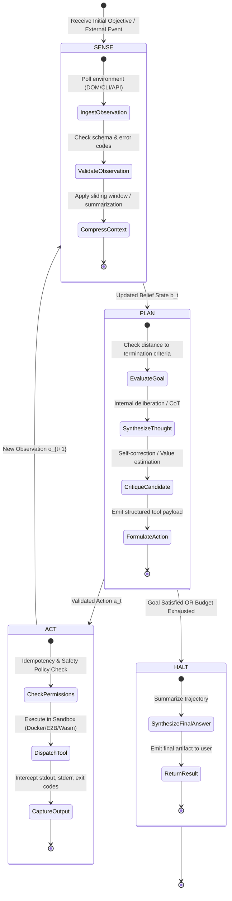
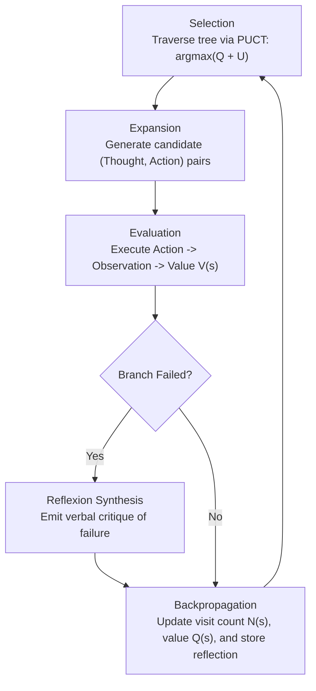

# Agent Foundations, Reasoning Paradigms, and Cognitive Loops

**Author:** Senior Principal Agentic AI Researcher & Distributed Autonomous Systems Architect  
**Scope:** Theoretical Foundations, POMDP Formulations, Cognitive Reasoning Architectures, State Machine Topologies, and Empirical Benchmarks  
**Status:** University-Level Reference Manual & Production Architectural Guide  

---

## 1. Executive Summary & Epistemological Foundations

### 1.1 The Evolution of Agency in Artificial Intelligence
The conceptual trajectory of artificial agency spans more than seven decades, transitioning through three distinct epochs:

1. **Cybernetics and Homeostatic Systems (1940s–1950s):** Norbert Wiener's formulation of cybernetics (*Cybernetics: Or Control and Communication in the Animal and the Machine*, 1948) grounded agency in closed feedback loops where sensors measure environmental deviations from a target setpoint, and actuators apply corrective force to preserve equilibrium.
2. **Symbolic AI and BDI Architectures (1980s–1990s):** Rao and Georgeff (1995) formalized the Belief-Desire-Intention (BDI) software model, synthesizing Bratman's philosophical theory of practical reasoning. Here, an agent maintains explicit mental states: **Beliefs** (state of the world), **Desires** (computational goals), and **Intentions** (chosen operational plans). Russell & Norvig (*Artificial Intelligence: A Modern Approach*) crystallized the standard definition of an agent: *an entity that perceives its environment through sensors and acts upon that environment through actuators to maximize its expected utility*.
3. **Foundation Model Agents (2022–Present):** Contemporary agentic AI replaces hand-engineered symbolic transition systems with autoregressive Large Language Models (LLMs). The LLM functions as an implicit, open-domain cognitive engine that processes high-dimensional, unstructured multimodal observations, updates an autoregressive belief state maintained within its context window, and emits discrete actions (structured text, tool invocations, or environment commands).

```
   +--------------------------------------------------------------------+
   |                       AUTONOMOUS ENVIRONMENT                       |
   +--------------------------------------------------------------------+
              ^                                            |
              | Executable Actions                         | Raw Observations
              | [API Calls, Shell, File Edits]             | [Stdout, DOM, Errors]
              |                                            v
   +-----------------------+                      +---------------------+
   |       ACTUATORS       |                      |       SENSORS       |
   | (Tool Execution / RPC)|                      | (Context Ingestion) |
   +-----------------------+                      +---------------------+
              ^                                            |
              | Structured Parameters                      | Formatted Tokens
              |                                            v
   +--------------------------------------------------------------------+
   |                         COGNITIVE ENGINE                           |
   |                                                                    |
   |   Belief State b_t = P(s_t | o_{1:t}, a_{1:t-1})                   |
   |                                                                    |
   |   +-------------------+  Thought/Plan   +----------------------+   |
   |   | Working Memory /  | --------------> | Reasoning / Critique |   |
   |   | Context Window    | <-------------- | Engine (LLM / MCTS)  |   |
   |   +-------------------+  State Update   +----------------------+   |
   |             |                                     |                |
   |             v Paging / Semantic Retrieval         v Next Step      |
   |   +-------------------+                 +----------------------+   |
   |   | Long-Term Memory  |                 | Action Selection     |   |
   |   | (Episodic/Vector) |                 | Policy pi(a_t | b_t) |   |
   |   +-------------------+                 +----------------------+   |
   +--------------------------------------------------------------------+
```

### 1.2 Defining Agency: Autonomy, Reactivity, Proactiveness, and Social Ability
Following Wooldridge & Jennings (*Intelligent Agents: Theory and Practice*, 1995), a computational system exhibits true agency if and only if it simultaneously satisfies four orthogonal criteria:

* **Autonomy:** Operating without direct external intervention, maintaining control over internal state and operational trajectory.
* **Reactivity:** Detecting environmental perturbations in real time and executing bounded, adaptive responses.
* **Proactiveness:** Displaying goal-directed behavior by initiating actions dynamically rather than operating purely as a passive respondent.
* **Social Ability:** Interacting with peer agents, humans, and third-party computational nodes via standardized communication protocols.

---

## 2. The Agency Spectrum: Workflows vs. DAG Chains vs. Autonomous Agents

A major source of architectural failure in industry is the conflation of **deterministic workflows** with **autonomous agents**. Anthropic's landmark engineering taxonomy (*Building Effective Agents*, 2024) formalizes this continuum:

```
[Deterministic Control] -----------------------------------------> [Stochastic Autonomy]

  Prompt      Routing /      Parallel /      Orchestrator-    Evaluator-      Fully Autonomous
  Chains       Branch         Voting           Workers        Optimizer            Agent
 (Static DAG) (Rule/LLM)    (MapReduce)       (Dynamic)      (Iterative)       (Open Loop)
```

### 2.1 Comparative Architectural Matrix

| Architectural Pattern | Control Flow Topology | State Space Determinism | Dynamic Re-planning | Error Recovery Mechanism | Human Inspectability | Failure Modes |
| :--- | :--- | :--- | :--- | :--- | :--- | :--- |
| **Augmented LLM** | Point-to-point call | High (single turn) | None | None (caller must retry) | Complete | Schema violation, hallucinated output |
| **Prompt Chain (DAG)** | Fixed Directed Acyclic Graph | Deterministic transitions | No | Static retry on failed step | High (each node auditable) | Compounding error drift along chain |
| **Router / Dispatcher** | 1-to-N Conditional Branch | Bounded to predefined branches | No | Fallback branch | High | Classification error at routing node |
| **Parallel / Fan-Out** | Scatter-gather (MapReduce) | Deterministic aggregation | No | Majority voting / Consensus | High | Consensus on hallucinated fact, latency ceiling |
| **Orchestrator-Workers** | Hierarchical dynamic task delegation | Partially deterministic | Yes (task-level synthesis) | Worker reassignment by orchestrator | Moderate | Subtask decomposition hallucination, context bloat |
| **Evaluator-Optimizer** | Cyclic feedback loop (Generator-Critic) | Bounded iterations | Yes (local optimization) | Iterative critique and regeneration | High | Critic false acceptance, infinite oscillation |
| **Autonomous Agent** | Dynamic cyclic graph with arbitrary branching | Non-deterministic, environment-driven | Complete (emergent trajectory) | Dynamic environment sensing & replanning | Low (trajectory is emergent) | Infinite loops, goal drift, tool paralysis, runaway spend |

### 2.2 Algorithmic Topology Comparison

#### 2.2.1 Deterministic DAG Workflow (LangChain / Airflow Paradigm)
In a deterministic workflow, the execution graph $G = (V, E)$ is static and known *a priori*. Nodes $v_i \in V$ represent deterministic computations or single-shot LLM transformations. Edges $e_{ij} = (v_i, v_j) \in E$ define static data pipelines. Conditional branching is governed by explicit predicates $p: \text{Output}(v_i) \rightarrow \{0, 1\}$.

$$\text{NextNode}(v_i) = \arg\max_{v_j \in \text{Children}(v_i)} p(v_i, v_j)$$

#### 2.2.2 Autonomous Agent Loop (ReAct / POMDP Paradigm)
In an autonomous agent, the execution graph is **not static**; it is constructed dynamically at runtime. The transition to the next state is governed by an unconstrained policy $\pi(a_t | s_t)$ parameterized by the LLM, where the action space includes arbitrary tool calls, context edits, and environment modifications. The graph topology is emergent and cyclic:

$$s_{t+1} \sim \mathcal{T}(s_t, a_t), \quad a_t \sim \pi_\theta(a_t | s_t)$$

---

## 3. Formal State Machine & Sense-Plan-Act Dynamics

### 3.1 Partially Observable Markov Decision Process (POMDP) Formulation
An agent operating in complex software, physical, or digital environments does not possess complete information about the underlying ground truth state of the universe. It must therefore be modeled as a **Partially Observable Markov Decision Process (POMDP)**, defined by the 7-tuple:

$$\mathcal{M} = \langle \mathcal{S}, \mathcal{A}, \mathcal{T}, \mathcal{R}, \Omega, \mathcal{O}, \gamma \rangle$$

Where:
* $\mathcal{S}$ is the set of unobservable true environment states (e.g., total database contents, entire operating system kernel memory, remote server state).
* $\mathcal{A}$ is the set of actions available to the agent (e.g., API calls, SQL queries, Bash commands, keyboard/mouse events).
* $\mathcal{T}: \mathcal{S} \times \mathcal{A} \rightarrow \Delta(\mathcal{S})$ is the transition probability function $\mathcal{T}(s' \mid s, a)$, defining the environment state transition under action $a$.
* $\mathcal{R}: \mathcal{S} \times \mathcal{A} \rightarrow \mathbb{R}$ is the reward function (often sparse or absent in open-ended LLM agency, replaced by implicit prompt objectives).
* $\Omega$ is the set of observable outputs (e.g., HTTP response payloads, terminal standard out/err, parsed DOM trees).
* $\mathcal{O}: \mathcal{S} \times \mathcal{A} \rightarrow \Delta(\Omega)$ is the observation probability function $\mathcal{O}(o \mid s', a)$, modeling sensor noise, truncation, or token-window limits.
* $\gamma \in [0, 1)$ is the temporal discount factor.

### 3.2 The Context Window as an Autoregressive Belief State
Because the state is partially observable, the agent cannot condition its actions purely on the current observation $o_t$. It must condition on the complete interaction history:

$$H_t = (o_1, a_1, o_2, a_2, \dots, a_{t-1}, o_t)$$

In cognitive robotics, this is addressed by maintaining a **belief state** $b_t = P(s_t \mid H_t)$. In an LLM-based agent, the **context window serves as the non-parametric, autoregressive representation of the belief state**:

$$b_t \approx \mathbf{C}_t = \left[ \mathbf{x}_{\text{system}}, \mathbf{x}_{\text{user}}, \mathbf{x}_{a_1}, \mathbf{x}_{o_1}, \dots, \mathbf{x}_{a_{t-1}}, \mathbf{x}_{o_t} \right]$$

The agent policy $\pi_\theta(a_t \mid b_t)$ generates the next action by sampling from the token distribution parameterized by model weights $\theta$:

$$\pi_\theta(a_t \mid \mathbf{C}_t) = \prod_{k=1}^{K} P_\theta(w_k \mid \mathbf{C}_t, w_{1:k-1})$$

Where $a_t = (w_1, w_2, \dots, w_K)$ represents the serialized action tokens (e.g., a JSON-RPC tool invocation).

### 3.3 The Sense-Plan-Act Cycle State Machine



### 3.4 Rigorous Formal Pseudocode: The POMDP Autonomous Agent Loop

```python
"""
Formal Algorithm: Autonomous POMDP Agent Loop with State Compression and Halting Guards
"""
from typing import Any, Dict, List, Optional, Tuple
from dataclasses import dataclass, field
import time
import hashlib

@dataclass
class Action:
    tool_name: str
    arguments: Dict[str, Any]
    is_terminal: bool = False
    raw_payload: str = ""

@dataclass
class Observation:
    content: str
    status_code: int
    is_error: bool = False
    metadata: Dict[str, Any] = field(default_factory=dict)

@dataclass
class AgentState:
    trajectory: List[Tuple[Optional[Action], Observation]] = field(default_factory=list)
    step_count: int = 0
    token_usage: int = 0
    cost_usd: float = 0.0
    action_hashes: List[str] = field(default_factory=list)
    is_halted: bool = False
    halt_reason: Optional[str] = None

class Environment:
    def execute(self, action: Action) -> Observation:
        raise NotImplementedError

class LLMClient:
    def sample(self, prompt_tokens: List[Dict[str, str]], stop_sequences: List[str]) -> Tuple[str, int, float]:
        raise NotImplementedError
    def count_tokens(self, messages: List[Dict[str, str]]) -> int:
        raise NotImplementedError

class AutonomousPOMDPAgent:
    def __init__(
        self,
        llm: LLMClient,
        env: Environment,
        system_instruction: str,
        max_steps: int = 30,
        max_cost_usd: float = 5.0,
        max_context_tokens: int = 16384,
        loop_detection_window: int = 3
    ):
        self.llm = llm
        self.env = env
        self.system_instruction = system_instruction
        self.max_steps = max_steps
        self.max_cost_usd = max_cost_usd
        self.max_context_tokens = max_context_tokens
        self.loop_detection_window = loop_detection_window

    def _hash_action(self, action: Action) -> str:
        serialized = f"{action.tool_name}:{sorted(action.arguments.items())}"
        return hashlib.sha256(serialized.encode('utf-8')).hexdigest()

    def _check_halting_conditions(self, state: AgentState, candidate_action: Optional[Action] = None) -> Tuple[bool, Optional[str]]:
        if candidate_action and candidate_action.is_terminal:
            return True, "GOAL_ACHIEVED"
        if state.step_count >= self.max_steps:
            return True, "MAX_STEPS_EXCEEDED"
        if state.cost_usd >= self.max_cost_usd:
            return True, "BUDGET_EXHAUSTED"
        
        # Action Repetition / Infinite Loop Guard
        if candidate_action:
            action_h = self._hash_action(candidate_action)
            recent_hashes = state.action_hashes[-self.loop_detection_window:]
            if len(recent_hashes) == self.loop_detection_window and all(h == action_h for h in recent_hashes):
                return True, "CYCLE_DETECTED"
                
        return False, None

    def _compress_context(self, state: AgentState) -> List[Dict[str, str]]:
        """
        Compresses the belief state if token limits are approached.
        Preserves: System Prompt, Goal, Running Summaries, Recent K turns.
        """
        messages = [{"role": "system", "content": self.system_instruction}]
        for act, obs in state.trajectory:
            if act is not None:
                messages.append({"role": "assistant", "content": act.raw_payload})
            messages.append({"role": "user", "content": f"Observation: {obs.content}"})
            
        current_tokens = self.llm.count_tokens(messages)
        if current_tokens <= self.max_context_tokens:
            return messages

        # Context Overflow Handling: Summarize historical prefix
        k_keep = 4  # Keep last 4 interactions intact
        prefix = state.trajectory[:-k_keep]
        suffix = state.trajectory[-k_keep:]
        
        summary_prompt = [
            {"role": "system", "content": "Condense historical actions, results, and critical state variables into a factual summary."},
            {"role": "user", "content": "\n".join([f"A: {a.tool_name} -> O: {o.content[:200]}" for a, o in prefix if a])}
        ]
        summary_text, tokens, cost = self.llm.sample(summary_prompt, stop_sequences=[])
        state.cost_usd += cost
        state.token_usage += tokens
        
        compressed_messages = [
            {"role": "system", "content": self.system_instruction},
            {"role": "system", "content": f"[HISTORICAL BELIEF STATE SUMMARY]: {summary_text}"}
        ]
        for act, obs in suffix:
            if act is not None:
                compressed_messages.append({"role": "assistant", "content": act.raw_payload})
            compressed_messages.append({"role": "user", "content": f"Observation: {obs.content}"})
            
        return compressed_messages

    def run(self, initial_goal: str) -> Dict[str, Any]:
        state = AgentState()
        # Seed initial observation
        initial_obs = Observation(content=initial_goal, status_code=200)
        state.trajectory.append((None, initial_obs))

        while not state.is_halted:
            state.step_count += 1
            
            # 1. SENSE: Prepare Belief State
            context_messages = self._compress_context(state)
            
            # 2. PLAN: Deliberation & Action Synthesis
            raw_response, tokens, cost = self.llm.sample(context_messages, stop_sequences=["</action>"])
            state.token_usage += tokens
            state.cost_usd += cost
            
            # Parse action (assuming ReAct/XML/JSON schema)
            action = self._parse_action(raw_response)
            
            # Check for termination
            should_halt, halt_reason = self._check_halting_conditions(state, action)
            if should_halt:
                state.is_halted = True
                state.halt_reason = halt_reason
                break
                
            state.action_hashes.append(self._hash_action(action))

            # 3. ACT: Execute Action in Environment
            observation = self.env.execute(action)
            
            # Update trajectory
            state.trajectory.append((action, observation))

        return {
            "status": state.halt_reason,
            "steps": state.step_count,
            "cost_usd": state.cost_usd,
            "token_usage": state.token_usage,
            "final_answer": state.trajectory[-1][0].arguments.get("answer") if state.trajectory[-1][0] else None
        }

    def _parse_action(self, payload: str) -> Action:
        # Schema parser implementation (JSON or Tag-based)
        # Placeholder illustrating extraction logic
        if "final_answer" in payload:
            return Action(tool_name="final_answer", arguments={"answer": payload}, is_terminal=True, raw_payload=payload)
        return Action(tool_name="execute_command", arguments={"cmd": payload}, is_terminal=False, raw_payload=payload)
```

---

## 4. Halting Conditions, Non-Determinism, and Failure Dynamics

### 4.1 Theoretical & Operational Halting Conditions
Unlike classical programs governed by computable Turing halting invariants, an autonomous agent operates over a continuous and stochastic action space. Halting must be enforced through multi-layered defensive boundary guards:

1. **Explicit Semantic Termination:** The agent issues an explicit meta-action designating goal achievement (e.g., `final_answer(result)` or `<terminate>SUCCESS</terminate>`).
2. **Step Budget Horizon Truncation ($t \ge T_{\max}$):** Enforcing a strict upper bound on execution graph depth.
3. **Financial / Token Budget Ceiling:** Halting execution when accumulated inference and tool execution costs cross a threshold $C_t \ge C_{\max}$.
4. **Action Cycle Detection:** Detecting topological loops where the agent oscillates between identical state transitions. Measured via:
   * **Hash Exact Matching:** $H(a_t) == H(a_{t-k})$ across sliding window $k$.
   * **Normalized Levenshtein / Jaccard Distance:** Quantifying semantic repetition in generated thoughts or commands:
     $$\mathcal{D}(a_t, a_{t-1}) < \epsilon_{\text{threshold}}$$
5. **Epistemic Entropy & Value Convergence:** In tree search or reflective agents, termination triggers when policy value updates fail to exceed a minimal improvement delta:
   $$|V(s_t) - V(s_{t-1})| < \delta_{\min}$$

### 4.2 Handling Non-Determinism in Autoregressive Inference
Even with temperature $T=0$, standard commercial LLM APIs exhibit run-to-run non-determinism due to:
* Sparse mixture-of-experts (MoE) token routing where thread race conditions alter floating-point summation orders.
* Non-associative floating-point operations in parallel matrix reductions (BLAS/cuBLAS routines).
* Dynamic batching server kernels.

#### Mitigation Architecture
* **Greedy Decoding ($T=0$):** Mandatory baseline for tool calling and planning steps.
* **Grammar-Constrained Decoding:** Eliminating syntactic nondeterminism via Finite State Machine logit masking (see Section 2 of Doc 02).
* **Deterministic Environment Resets:** Guaranteeing that the execution sandbox (Docker/E2B) resets to a bit-identical snapshot upon retry.
* **Trace Idempotency Keys:** Tagging external tool side-effects with UUIDs to prevent catastrophic duplicate execution during automated retries.

### 4.3 Taxonomy of Agent Failure Modes

```
+-------------------------------------------------------------------------------+
|                         AGENT FAILURE TAXONOMY                                |
+-------------------------------------------------------------------------------+
       |
       +---> 1. Cognitive / Reasoning Failures
       |       |
       |       +---> Plan Drift: Sub-goals overwrite the primary objective over time.
       |       +---> Sycophancy / Self-Reinforcing Delusion: Validating hallucinated
       |       |     facts in subsequent CoT steps without external grounding.
       |       +---> Premature Closure: Calling final_answer before completing subtasks.
       |
       +---> 2. Tool / Interaction Failures
       |       |
       |       +---> Tool Paralysis: Repeatedly querying tools with invalid arguments.
       |       +---> Observation Ingestion Failure: Tool output exceeds context window,
       |       |     causing catastrophic truncation of key information.
       |       +---> Idempotency Violation: Re-running mutating API calls (e.g., duplicate payments).
       |
       +---> 3. State & Memory Failures
               |
               +---> Context Saturation: Attention degradation ("Lost in the Middle").
               +---> Reflection Poisoning: Incorrect self-criticism recorded into long-term
                     episodic memory, corrupting future executions.
```

---

## 5. Cognitive Reasoning Paradigms: Comparative Analysis

### 5.1 Chain-of-Thought (CoT) (Wei et al., NeurIPS 2022)

#### 5.1.1 Theoretical Formulation
Chain-of-Thought prompts models to generate an intermediate sequence of natural language reasoning steps before outputting the final answer:

$$P(Y \mid X) = \sum_{Z} P(Y \mid X, Z) P(Z \mid X) \approx P(Y \mid X, \hat{Z}) P(\hat{Z} \mid X)$$

Where $X$ is the input query, $Y$ is the target answer, and $Z = (z_1, z_2, \dots, z_M)$ is the latent reasoning chain. By allocating test-time compute to intermediate tokens, CoT allows the model to decompose complex multi-step logical operations into smaller sub-computations.

```
Input X ---> [ Intermediate Latent Tokens z_1, z_2, ..., z_M ] ---> Final Output Y
```

#### 5.1.2 Limitations
* **Feedforward / Static Structure:** Cannot interact with external environments.
* **No Backtracking:** Errors introduced in early tokens $z_k$ irreversibly corrupt downstream reasoning $\hat{Z}_{>k}$ via error compounding:
  $$P(\text{Success}) \le \prod_{k=1}^M P(z_k \text{ is correct} \mid z_{<k})$$
* **Groundedness Deficit:** Unverifiable against ground truth physical/digital state.

---

### 5.2 ReAct: Synergizing Reasoning and Acting (Yao et al., ICLR 2023)

#### 5.2.1 Core Architectural Loop
ReAct interleaves natural language reasoning traces ("Thoughts") with domain-specific actions ("Actions") and environmental feedback ("Observations"):

$$\text{Thought}_t \rightarrow \text{Action}_t \rightarrow \text{Observation}_t \rightarrow \text{Thought}_{t+1}$$

```
+-----------------------------------------------------------------------------+
|                                REACT LOOP                                   |
+-----------------------------------------------------------------------------+
   |
   v
[ Thought t ]: Deliberate on belief state b_t, decompose sub-goal.
   |
   v
[ Action t ]:  Execute structured tool invocation a_t = f(arg_1, arg_2).
   |
   v
[ Observation t ]: Ingest environment output o_t ~ O(s_t, a_t).
   |
   +---> Interleave into Context: C_{t+1} = [C_t, Thought_t, Action_t, Observation_t]
   |
   v
[ Thought t+1 ]: Evaluate Observation t against sub-goal, formulate next action.
```

The synergy is bidirectional:
* **Reasoning directs actions:** The thought token sequence updates the internal belief state, performs planning, and extracts parameters for the tool.
* **Observations ground reasoning:** Real-world tool feedback corrects hallucinations and injects external truth.

#### 5.2.2 Algorithmic Pseudocode

```python
def react_agent_step(context: List[Dict[str, str]], llm, env) -> Tuple[bool, str, List[Dict[str, str]]]:
    """
    Executes a single step of the ReAct paradigm.
    """
    # Force model to generate Thought followed by Action
    stop_tokens = ["Observation:"]
    response = llm.generate(context, stop=stop_tokens)
    
    # Parse Thought and Action from response
    thought, action_str = parse_react_response(response)
    
    if is_final_answer(action_str):
        return True, extract_answer(action_str), context
        
    tool_name, tool_args = parse_tool_call(action_str)
    
    # Execute action in environment
    try:
        obs = env.call_tool(tool_name, tool_args)
    except Exception as e:
        obs = f"ExecutionError: {str(e)}"
        
    # Interleave into context
    context.append({"role": "assistant", "content": f"Thought: {thought}\nAction: {action_str}"})
    context.append({"role": "user", "content": f"Observation: {obs}"})
    
    return False, "", context
```

---

### 5.3 Tree of Thoughts (ToT) (Yao et al., NeurIPS 2023)

#### 5.3.1 Graph Search over Cognitive Units
Tree of Thoughts generalizes CoT by framing problem solving as a systematic tree search where each node represents a coherent unit of thought (e.g., an algebraic simplification, a coding design decision, or a plan step):

```
                       [ Root: Problem Statement ]
                               /    |    \
                             /      |      \
                      [ Thought 1] [T 2]  [Thought 3]
                        /     \             /     \
                     [T 1.1] [T 1.2]     [T 3.1] [T 3.2]
                                ^
                                | (Evaluated Best Path via Heuristic)
```

ToT defines four core operational primitives:
1. **Thought Decomposition:** Partitioning problem resolution into discrete intermediate states $s = [x, z_{1:i}]$.
2. **Thought Generator ($G$):** Proposing candidate next thoughts:
   * *Sample:* Sampling i.i.d. thoughts from a CoT prompt ($z^{(j)} \sim \pi(z \mid s)$).
   * *Propose:* Generating a batch of distinct thoughts sequentially in a single prompt.
3. **State Evaluator ($V$):** Computing a heuristic valuation of candidate nodes $s$:
   * *Value Heuristic:* Scoring state viability $V(s) \in [0, 1]$ or $\{ \text{sure, likely, impossible} \}$.
   * *Voting:* Comparing multiple candidate states and ranking them by consensus.
4. **Search Algorithm:** Exploring the search space using classical graph traversal:
   * **Breadth-First Search (BFS):** Keeping the top-$b$ promising states at each depth (Beam Search).
   * **Depth-First Search (DFS):** Exploring a single trajectory until terminal or pruned by $V(s) \le \tau_{\text{prune}}$, with backtracking.

#### 5.3.2 Algorithmic Pseudocode (ToT with BFS / Beam Search)

```python
from typing import List, Dict, Any

class TreeOfThoughtsBFS:
    def __init__(self, llm, thought_generator, state_evaluator, beam_width: int = 3, max_depth: int = 5):
        self.llm = llm
        self.generator = thought_generator
        self.evaluator = state_evaluator
        self.beam_width = beam_width
        self.max_depth = max_depth

    def solve(self, problem_description: str) -> Optional[str]:
        # Initial Frontier
        current_frontier: List[Dict[str, Any]] = [{"thoughts": [], "score": 1.0}]

        for depth in range(self.max_depth):
            candidates: List[Dict[str, Any]] = []
            
            # 1. Expand Frontier
            for state in current_frontier:
                candidate_thoughts = self.generator.propose_thoughts(
                    problem=problem_description,
                    current_path=state["thoughts"],
                    num_proposals=self.beam_width * 2
                )
                
                for thought in candidate_thoughts:
                    new_path = state["thoughts"] + [thought]
                    candidates.append({"thoughts": new_path, "score": 0.0})

            if not candidates:
                break

            # 2. Evaluate Candidates
            for candidate in candidates:
                candidate["score"] = self.evaluator.evaluate_state(
                    problem=problem_description,
                    candidate_path=candidate["thoughts"]
                )

            # 3. Prune Frontier (Keep Top-B)
            candidates.sort(key=lambda x: x["score"], reverse=True)
            current_frontier = candidates[:self.beam_width]

            # Check for terminal state
            best_state = current_frontier[0]
            if self.evaluator.is_solved(problem_description, best_state["thoughts"]):
                return "\n".join(best_state["thoughts"])

        return "\n".join(current_frontier[0]["thoughts"]) if current_frontier else None
```

---

### 5.4 Reflexion: Verbal Reinforcement Learning (Shinn et al., NeurIPS 2023)

#### 5.4.1 Theoretical Formulation
Reflexion endows agents with dynamic memory and self-reflection capabilities without updating model weights. It converts scalar reinforcement learning signals into **verbal reflections** that function as semantic gradient updates:

```
+-------------------------------------------------------------------------------+
|                             REFLEXION ARCHITECTURE                            |
+-------------------------------------------------------------------------------+
     |
     v
[ Actor Model M_a ] <------- Injects Episodic Reflection Buffer mem_ref
     |
     | Generates Trajectory tau_i = (s_0, a_0, o_0, ..., s_T)
     v
[ Evaluator Model M_e ] ----> Computes Scalar / Binary Performance Metric S(tau_i)
     |
     | S(tau_i) < Threshold (Task Failure)
     v
[ Self-Reflection Model M_r ]
     |
     | Generates Semantic Critique r_i = "I failed because X; next time I will Y"
     v
[ Reflection Memory Buffer mem_ref ] = [r_1, r_2, ..., r_k]
     |
     +---> Triggers Next Trial (tau_{i+1}) with Updated Prompt
```

Let $\tau_i$ be the execution trajectory at trial $i$. The Evaluator $M_e$ produces binary evaluation $E \in \{0, 1\}$. If $E = 0$, the Self-Reflection engine $M_r$ produces a natural language reflection $r_i$:

$$r_i \sim M_r(r_i \mid \tau_i, E)$$

The reflection is appended to episodic memory $\mathcal{M}_{\text{ref}} \leftarrow \mathcal{M}_{\text{ref}} \cup \{ r_i \}$. In trial $i+1$, the Actor $M_a$ conditions on the accumulated verbal critiques:

$$a_t^{(i+1)} \sim M_a(a_t \mid s_t, \mathcal{M}_{\text{ref}})$$

This acts as an in-context policy improvement operator:

$$\mathbb{E}_{\tau \sim \pi(\cdot \mid \mathcal{M}_{\text{ref}})} [R(\tau)] > \mathbb{E}_{\tau \sim \pi(\cdot \mid \emptyset)} [R(\tau)]$$

---

### 5.5 Plan-and-Solve Prompting (Wang et al., ACL 2023)

#### 5.5.1 The Deliberative Two-Stage Paradigm
Plan-and-Solve replaces the step-by-step myopic decisions of standard CoT and ReAct with explicit, global trajectory planning prior to execution:

1. **Stage 1 (Plan Decomposition):** The model generates an end-to-end plan consisting of ordered subtasks:
   $$\mathcal{P} = (p_1, p_2, \dots, p_K)$$
2. **Stage 2 (Solve Execution):** The model sequentially executes each subtask $p_k$, conditioning on the results of $p_{<k}$.

```
Input Problem ---> [ Global Plan Decomposition: p_1, p_2, ..., p_K ]
                         |
                         +---> Step 1: Execute p_1 -> Output 1
                         |
                         +---> Step 2: Execute p_2(Output 1) -> Output 2
                         |
                         +---> Step K: Execute p_K(Output K-1) -> Final Solution
```

#### 5.5.2 Comparison with ReAct
* **Advantage:** Mitigates greedy, short-sighted tool invocations; establishes global problem structure upfront.
* **Failure Mode:** **Static Plan Rigidity.** If step $p_2$ fails due to an unexpected environment error, a purely feedforward Plan-and-Solve agent blindly executes $p_3$ on corrupt data. Production architectures address this by using **Dynamic Replanning** (Plan-and-Solve-and-Replan).

---

### 5.6 Language Agent Tree Search (LATS) (Zhou et al., ICML 2024)

#### 5.6.1 Unification of MCTS, ReAct, and Reflexion
Language Agent Tree Search (LATS) represents the state-of-the-art in autonomous deliberation, unifying:
* **Tree-based Search:** Leveraging Monte Carlo Tree Search (MCTS) for multi-path exploration.
* **Environment Grounding:** Utilizing ReAct for action execution and observation acquisition.
* **Verbal Learning:** Employing Reflexion to synthesize semantic feedback upon branch failure.



#### 5.6.2 The Four MCTS Phases in LATS

1. **Selection:** Starting at root state $s_0$, recursively traverse child nodes using the Upper Confidence Bound for Trees (UCT / PUCT):
   $$a^* = \arg\max_{a} \left[ Q(s, a) + c_{\text{puct}} \cdot P(a \mid s) \cdot \frac{\sqrt{N(s)}}{1 + N(s, a)} \right]$$
   Where $Q(s, a)$ is the average value score, $P(a \mid s)$ is the model's prior probability, and $N(s, a)$ is the visit count.
2. **Expansion:** At leaf state $s_L$, sample $k$ distinct candidate (Thought, Action) pairs via the LLM:
   $$\{(T^{(i)}, A^{(i)})\}_{i=1}^k \sim \pi_\theta(\cdot \mid s_L)$$
3. **Evaluation:** For each candidate node, execute action $A^{(i)}$ in the environment to obtain observation $O^{(i)}$. Compute heuristic value $V(s')$ using an LLM self-evaluator or external environment reward.
4. **Backpropagation & Reflection:** Propagate value updates back up the ancestor trajectory:
   $$N(s) \leftarrow N(s) + 1, \quad Q(s) \leftarrow Q(s) + \frac{V - Q(s)}{N(s)}$$
   If a trajectory yields a terminal failure, invoke a Reflexion engine to synthesize a verbal critique $r$. Attach $r$ to the parent node to inform future expansions.

---

## 6. Empirical Benchmarks & Comparative Performance Matrix

### 6.1 Standardized Agent Benchmarks

* **SWE-bench (Jimenez et al., ICLR 2024):** 2,294 real-world GitHub issues from popular Python repositories (Django, SymPy, Flask). The agent must clone the repository, locate the bug, edit code files across directories, and pass hidden regression unit tests. Benchmarks: *SWE-bench Lite* (300 issues) and *SWE-bench Verified* (500 human-validated issues).
* **GAIA (Mialon et al., ICLR 2024):** General AI Assistants benchmark. 466 complex, multimodal questions requiring multimodal web browsing, PDF parsing, Excel computation, and precise tool execution. Designed to be easy for humans (92% accuracy) but difficult for pure LLMs.
* **WebArena (Zhou et al., ICLR 2024):** End-to-end web environment consisting of functional clones of GitLab, Shopping (e-commerce), Reddit, and Wikipedia. Agents interact via raw accessibility trees and browser actions (click, scroll, type).

### 6.2 Empirical Paradigm Comparison Matrix

| Reasoning Paradigm | Planning Depth | Environment Grounding | Backtracking Capability | Self-Correction Mechanism | Token / Cost Overhead | SWE-bench Verified Pass Rate (Approx.) | GAIA Level 3 Score |
| :--- | :--- | :--- | :--- | :--- | :--- | :--- | :--- |
| **Direct Prompting** | None ($O(1)$) | None | None | None | $1\times$ (Baseline) | < 2% | < 5% |
| **Chain-of-Thought (CoT)** | Linear ($O(K)$) | None | None | None | $1.5\times - 3\times$ | 3% – 5% | 8% – 12% |
| **ReAct** | Linear-Cyclic | High (Real-time) | Primitive (retry) | Implicit (via new observations) | $5\times - 15\times$ | 15% – 25% | 25% – 35% |
| **Plan-and-Solve** | Global 2-Stage | Low to Moderate | None (without replanner) | Feedforward subtask check | $3\times - 6\times$ | 10% – 18% | 18% – 24% |
| **Tree of Thoughts (ToT)** | Tree ($O(B^D)$) | Low (State Search) | Complete (BFS/DFS) | Explicit Heuristic Evaluation | $20\times - 50\times$ | 20% – 30% | 28% – 38% |
| **Reflexion** | Multi-Trial | High (Episodic) | Inter-trial reset | Explicit Semantic Reflection | $10\times - 40\times$ | 25% – 35% | 35% – 45% |
| **LATS** | Full MCTS Graph | High (Real-time) | Systematic (UCT Backtracking)| Unified Value + Semantic Reflection| $50\times - 200\times$ | 35% – 48% | 45% – 58% |

---

## 7. Primary Literature Citations

1. **Wiener, N. (1948).** *Cybernetics: Or Control and Communication in the Animal and the Machine.* Technology Press / John Wiley & Sons.
2. **Rao, A. S., & Georgeff, M. P. (1995).** *BDI Agents: From Theory to Practice.* Proceedings of the First International Conference on Multiagent Systems (ICMAS-95), pp. 312–319.
3. **Wooldridge, M., & Jennings, N. R. (1995).** *Intelligent Agents: Theory and Practice.* Knowledge Engineering Review, 10(2), 115–152.
4. **Wei, J., Wang, X., Schuurmans, D., Bosma, M., Chi, E., Le, Q., & Zhou, D. (2022).** *Chain-of-Thought Prompting Elicits Reasoning in Large Language Models.* Advances in Neural Information Processing Systems (NeurIPS 2022), 35, 24824–24837.
5. **Yao, S., Zhao, J., Yu, D., Du, N., Shafran, I., Narasimhan, K., & Cao, Y. (2023).** *ReAct: Synergizing Reasoning and Acting in Language Models.* International Conference on Learning Representations (ICLR 2023).
6. **Yao, S., Yu, D., Zhao, J., Shafran, I., Griffiths, T. L., Cao, Y., & Narasimhan, K. (2023).** *Tree of Thoughts: Deliberate Problem Solving with Large Language Models.* Advances in Neural Information Processing Systems (NeurIPS 2023), 36.
7. **Shinn, N., Cassano, F., Gopinath, A., Narasimhan, K., & Yao, S. (2023).** *Reflexion: Language Agents with Verbal Reinforcement Learning.* Advances in Neural Information Processing Systems (NeurIPS 2023), 36.
8. **Wang, L., Xu, W., Lan, Y., Hu, Z., Lan, Y., Lee, R. K. W., & Lim, E. P. (2023).** *Plan-and-Solve Prompting: Improving Zero-Shot Chain-of-Thought Reasoning by Large Language Models.* Association for Computational Linguistics (ACL 2023), pp. 2609–2634.
9. **Zhou, A., Yan, K., Shlapentokh-Rothman, M., Wang, H., & Wang, Y. X. (2024).** *Language Agent Tree Search Unifies Reasoning, Acting, and Planning in Language Models.* International Conference on Machine Learning (ICML 2024).
10. **Jimenez, C. E., Yang, J., Wettig, A., Yao, S., Pei, K., Press, O., & Narasimhan, K. (2024).** *SWE-bench: Can Language Models Resolve Real-World GitHub Issues?* International Conference on Learning Representations (ICLR 2024).
11. **Anthropic. (2024).** *Building Effective Agents.* Anthropic Technical Research Report.
