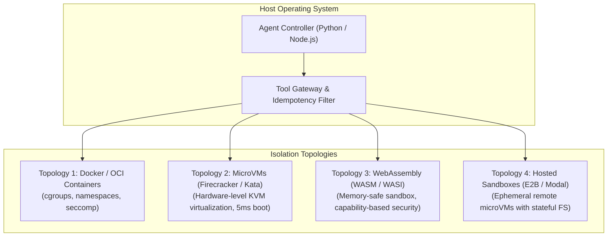
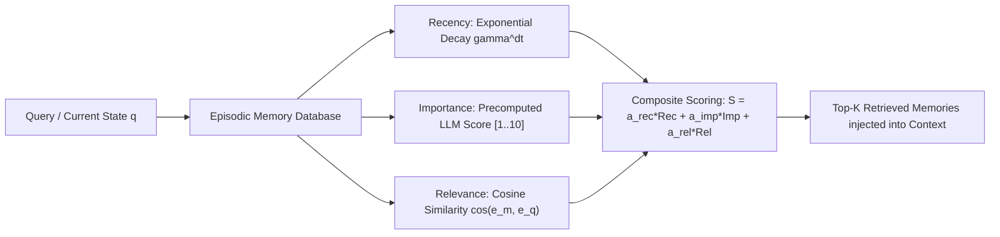

# Production Tool Use, Structured Decoding, and Agent Memory Architectures

**Author:** Senior Principal Agentic AI Researcher & Distributed Autonomous Systems Architect  
**Scope:** Grammar-Constrained Sampling, Function Calling Infrastructure, Sandbox Execution, and Hierarchical Cognitive Memory Systems  
**Status:** University-Level Reference Manual & Production Architectural Guide  

---

## 1. Tool Use & Function Calling Mechanisms

### 1.1 Evolution of Tool Interfacing: Natural Language to Constrained Grammars
The paradigm of tool utilization in Large Language Models has evolved through three distinct technical generations:

1. **Unconstrained Text Prompting (2022–2023):** Relying on few-shot prompts instructing the model to emit tool invocations inside markdown code blocks (e.g., ````json { "tool": "calc", "args": ... } ````). Vulnerable to syntax corruption, markdown fence hallucination, and schema hallucinations.
2. **Fine-Tuned Native Function Calling (2023–Present):** Models fine-tuned on specialized control tokens (e.g., `<|start_header_id|>ipython<|end_header_id|>`, `<tool_call>`, `<function=name>`). While dramatically improving intent detection, raw autoregressive generation still exhibits a non-zero probability ($\sim 2-5\%$) of emitting malformed JSON or type errors.
3. **Grammar-Constrained Decoding (GCD) (2023–Present):** Forcing autoregressive decoding at the token level to strictly conform to a formal grammar (Context-Free Grammar or Regular Expression) derived from a target JSON Schema or Pydantic model.

---

### 1.2 Grammar-Constrained Decoding (GCD) Theory & Mathematics

#### 1.2.1 Token-Level Logit Masking
In standard autoregressive language modeling, the probability of sampling token $w_t$ from vocabulary $\mathcal{V}$ given context $w_{<t}$ is given by the softmax distribution over unnormalized logits $\mathbf{z}_t \in \mathbb{R}^{|\mathcal{V}|}$:

$$P(w_t \mid w_{<t}) = \frac{\exp(z_{t, w_t})}{\sum_{v \in \mathcal{V}} \exp(z_{t, v})}$$

Under Grammar-Constrained Decoding (e.g., Outlines [Willard & Louf, 2023], vLLM Guided Decoding, GBNF), generation is constrained by a formal Finite State Machine (FSM) or Pushdown Automaton (PDA) $\mathcal{M} = (Q, \Sigma, \delta, q_0, F)$:
* $Q$ is the finite set of parser states.
* $\Sigma$ is the character alphabet.
* $\delta: Q \times \Sigma \rightarrow Q$ is the state transition function.
* $q_0 \in Q$ is the initial state.
* $F \subseteq Q$ is the set of accepting states.

At decoding step $t$, with current parser state $q_t \in Q$, a binary mask vector $\mathbf{m}_t \in \{0, 1\}^{|\mathcal{V}|}$ is computed:

$$m_{t, v} = \begin{cases} 
1 & \text{if } \forall c \in \text{string}(v), \, \delta^*(q_t, c) \text{ is valid and non-dead} \\
0 & \text{otherwise}
\end{cases}$$

The logits are transformed prior to softmax evaluation:

$$\tilde{z}_{t, v} = \begin{cases} 
z_{t, v} & \text{if } m_{t, v} = 1 \\
-\infty & \text{if } m_{t, v} = 0
\end{cases}$$

$$P_{\text{constrained}}(w_t \mid w_{<t}) = \frac{\exp(\tilde{z}_{t, w_t})}{\sum_{v \in \mathcal{V}} \exp(\tilde{z}_{t, v})}$$

```
Logits z_t [|V|]  ---> [ Mask m_t from FSM: Valid Next Tokens ] ---> Logits z_tilde ---> Softmax ---> Sample w_t
                                      ^
                                      | Updates Parser State
                               [ FSM State q_t ]
```

#### 1.2.2 Algorithmic Guarantee
* **100% Syntactic Validity:** It is mathematically impossible for the LLM to emit invalid JSON or violates types defined in the JSON Schema.
* **Latency Overhead:** FSM indexing incurs a one-time precomputation cost ($O(|Q| \cdot |\mathcal{V}|)$) during schema compilation, but per-token logit masking adds $< 1.5\text{ ms}$ overhead during inference.

---

### 1.3 Concrete Implementation: Pydantic v2 Schema Compilation & FSM Decoding

```python
"""
Grammar-Constrained Decoding Pipeline with Pydantic v2 and Finite State Machine Compilation
"""
from typing import List, Dict, Any, Optional
from pydantic import BaseModel, Field
import json
import re

# 1. Domain Action Schema Definition
class DatabaseQuerySchema(BaseModel):
    query_type: str = Field(..., description="Type of query", pattern="^(SELECT|INSERT|UPDATE|DELETE)$")
    table_name: str = Field(..., min_length=1, max_length=64)
    columns: List[str] = Field(default_factory=list, description="Target column projections")
    filter_clause: Optional[str] = Field(None, description="WHERE clause without SQL injection vectors")
    limit: int = Field(default=50, ge=1, le=1000)

# 2. Mock Tokenizer & Vocabulary
VOCABULARY = {
    0: '{"', 1: 'query_type', 2: '":', 3: ' "', 4: 'SELECT', 5: 'UPDATE',
    6: '",', 7: ' "table_name": "', 8: 'users', 9: 'orders', 10: 'limit": ',
    11: '50', 12: '}'
}

class RegexFSM:
    """
    Simplified representation of an FSM constructed from a regex/JSON schema.
    """
    def __init__(self, pattern: str):
        self.pattern = re.compile(pattern)

    def get_valid_next_tokens(self, current_prefix: str, vocab: Dict[int, str]) -> List[int]:
        valid_indices = []
        for token_id, token_str in vocab.items():
            candidate = current_prefix + token_str
            # In production, check if candidate can lead to an accepting state in the compiled DFA
            # Here simulated via regex partial matching
            if self._is_partial_match(candidate):
                valid_indices.append(token_id)
        return valid_indices

    def _is_partial_match(self, s: str) -> bool:
        # Check if s matches prefix of the grammar
        return True # Production engines evaluate compiled DFA transitions

def grammar_constrained_sample(logits: List[float], valid_token_ids: List[int]) -> int:
    """
    Masks non-valid token logits to -infinity before sampling.
    """
    masked_logits = [-float('inf')] * len(logits)
    for idx in valid_token_ids:
        masked_logits[idx] = logits[idx]
    
    # Greedy argmax over valid logits
    return max(range(len(masked_logits)), key=lambda i: masked_logits[i])
```

---

## 2. Tool Orchestration, Registry, and Selection

### 2.1 The Context Saturation Bottleneck
When scaling an agent system to enterprise tool repositories ($N > 50$ tools), injecting every tool definition into the system prompt causes severe performance degradation:
1. **Context Window Exhaustion:** 100 tool definitions average 15,000–30,000 tokens of static overhead per turn.
2. **Attention Dilution ("Lost in the Middle" - Liu et al., 2023):** LLMs struggle with needle-in-a-haystack tool selection, frequently selecting irrelevant tools with similar names.
3. **Inference Latency & Cost:** Prefill latency scales linearly with context length; operational cost increases quadratically or linearly depending on caching layers.

```
Total Tool Registry (>1000 Tools)
               |
               v Vector Search / BM25 Index
      [ Semantic Tool Retrieval ] <--- Query: Current Goal / Thought
               |
               v Top-K Candidate Schemas (e.g., K=5)
      [ Dynamic Schema Injection ]
               |
               v LLM Context Window
```

### 2.2 Retrieval-Augmented Tool Selection (RATS)
Instead of static context injection, state-of-the-art production systems employ **Retrieval-Augmented Tool Selection**:

1. **Offline Registry Indexing:** Each tool $T_i$ is registered with:
   * Unique identifier $\text{id}(T_i)$
   * Semantic docstring / description $D_i$
   * Input/Output JSON schema $S_i$
   * Embedded dense representation $\mathbf{e}_i = \text{Embed}(D_i \parallel \text{keys}(S_i))$
2. **Online Query Generation:** At step $t$, given thought/belief state $b_t$, generate query $q_t$:
   $$\mathbf{q}_t = \text{Embed}(b_t)$$
3. **Hybrid Tool Retrieval:** Combine dense vector similarity with sparse BM25 keyword matching over tool signatures:
   $$\text{Score}(T_i, q_t) = \alpha \cdot \frac{\mathbf{q}_t \cdot \mathbf{e}_i}{\|\mathbf{q}_t\| \|\mathbf{e}_i\|} + (1 - \alpha) \cdot \text{BM25}(q_t, D_i)$$
4. **Dynamic Schema Injection:** Select top-$K$ tools (typically $K \in [3, 7]$) and inject only their compiled schemas into the prompt for that specific execution step.

---

## 3. Execution Sandboxing, Safety, and Robustness

### 3.1 Sandboxing Topologies

Executing untrusted LLM-generated code or system commands requires multi-layered defensive isolation:



#### Detailed Isolation Matrix

| Sandbox Architecture | Isolation Level | Cold Start Latency | Memory Overhead | Network Egress Control | Primary Use Case |
| :--- | :--- | :--- | :--- | :--- | :--- |
| **Docker (OCI)** | Process isolation (Kernel namespaces) | $500\text{ ms} - 2\text{ s}$ | $\sim 50\text{ MB}$ | `iptables` / Docker networks | General CLI execution |
| **Firecracker MicroVM** | Hardware virtualization (KVM) | $< 10\text{ ms}$ | $\sim 5\text{ MB}$ | MicroVM tap devices | Multi-tenant code execution |
| **gVisor (runsc)** | Application kernel in user space | $100\text{ ms} - 300\text{ ms}$ | $\sim 15\text{ MB}$ | Sentry proxy filtering | Untrusted file inspection |
| **WebAssembly (WASI)** | Linear memory capability model | $< 1\text{ ms}$ | $< 1\text{ MB}$ | Capability-restricted host bindings | Math, parsing, data transformation |
| **E2B / Modal** | Managed cloud MicroVMs | $100\text{ ms} - 500\text{ ms}$ | Managed | Managed egress rules | Production AI agents (SWE-bench) |

### 3.2 Error Recovery & Fault Tolerance Mechanics

#### 3.2.1 Parameter Validation & Reflection Retries
When a tool call fails (validation error, timeout, or execution failure), the agent must not crash. Instead, the runtime intercepts the error and formats it as an environment observation:

```python
def safe_execute_tool(tool_registry, tool_name: str, raw_arguments: Dict[str, Any], timeout_sec: float = 30.0) -> str:
    """
    Production Tool Execution Wrapper with Parameter Validation, Timeout, and Exception Interception.
    """
    if tool_name not in tool_registry:
        return json.dumps({
            "status": "error",
            "error_type": "ToolNotFound",
            "message": f"Tool '{tool_name}' does not exist. Available tools: {list(tool_registry.keys())}"
        })
        
    tool = tool_registry[tool_name]
    
    # 1. Parameter Validation via Pydantic
    try:
        validated_args = tool.schema(**raw_arguments)
    except Exception as validation_err:
        return json.dumps({
            "status": "error",
            "error_type": "ValidationError",
            "details": str(validation_err),
            "hint": "Ensure argument types match the specified schema exactly."
        })
        
    # 2. Sandboxed Execution with Timeout
    try:
        result = execute_with_timeout(tool.run, args=(validated_args,), timeout=timeout_sec)
        return json.dumps({"status": "success", "result": result})
    except TimeoutError:
        return json.dumps({
            "status": "error",
            "error_type": "ExecutionTimeout",
            "message": f"Tool execution exceeded timeout of {timeout_sec} seconds. Optimize your query or break into subtasks."
        })
    except Exception as runtime_err:
        return json.dumps({
            "status": "error",
            "error_type": "RuntimeExecutionError",
            "exception_class": runtime_err.__class__.__name__,
            "message": str(runtime_err)
        })
```

### 3.3 Idempotency and Side-Effect Management
A catastrophic failure mode in autonomous systems is **uncontrolled side-effect duplication** (e.g., resubmitting a wire transfer or re-triggering cloud infrastructure teardown upon an API timeout).

#### Idempotency Classification Protocol
Every tool in the registry must declare its side-effect purity:
1. **Read-Only / Pure Tools ($\mathcal{A}_{\text{pure}}$):** Deterministic or non-mutating (e.g., `read_file`, `sql_select`, `web_search`). Safe for automated retry with exponential backoff.
2. **Mutating / State-Altering Tools ($\mathcal{A}_{\text{mutating}}$):** Irreversible or side-effect heavy (e.g., `execute_sql_dml`, `send_email`, `terminate_instance`).
   * **Mandatory Idempotency Keys:** Every request requires a client-generated UUID:
     $$\text{Key} = \text{SHA256}(\text{SessionID} \parallel \text{StepNumber} \parallel \text{ToolArgs})$$
     If an identical key is presented to the execution gateway within the lease TTL, the cached result is returned without re-executing.
   * **Human-In-The-Loop (HITL) Gates:** High-blast-radius operations trigger an `EXECUTION_PAUSED` state requiring cryptographic human approval via an administrative console.

---

## 4. Agent Memory Systems: Cognitive Classification & Architectures

Human cognitive architectures (Atkinson & Shiffrin, 1968) distinguish between Sensory Buffer, Short-Term / Working Memory, and Long-Term Memory. Autonomous software agents implement an exact structural mapping:

```
+------------------------------------------------------------------------------------+
|                               AGENT MEMORY TAXONOMY                                |
+------------------------------------------------------------------------------------+
       |
       +---> 1. Working Memory (Short-Term)
       |       |
       |       +---> Raw Context Window (Immediate attention span)
       |       +---> Attention Sinks & Streaming KV Cache
       |       +---> Ephemeral Scratchpads (Intermediate chain-of-thought traces)
       |
       +---> 2. Long-Term Episodic Memory
       |       |
       |       +---> Trajectory Logs (Chronological history of prior agent runs)
       |       +---> Vector-Indexed Interaction Chunks
       |       +---> Reflection Buffers (Synthesized verbal critiques)
       |
       +---> 3. Long-Term Semantic Memory
       |       |
       |       +---> Structured Entity-Relationship Knowledge Graphs (GraphRAG)
       |       +---> User Profile & Preference Stores
       |       +---> Ground-Truth Fact Repositories
       |
       +---> 4. Procedural Memory
               |
               +---> Dynamic Few-Shot In-Context Demonstrations
               +---> Verified Executable Skill Libraries (e.g., Voyager code skills)
               +---> Static Prompt Protocols & Guardrail Policies
```

---

## 5. Working Memory Management & Context Optimization

### 5.1 The Limits of Working Memory: "Lost in the Middle"
Liu et al. (*Lost in the Middle: How Language Models Use Long Contexts*, TACL 2023) demonstrated that model retrieval performance follows a U-shaped curve: information placed at the very beginning (primacy effect) or very end (recency effect) of long contexts is recalled with high accuracy, while information in the middle degrades sharply ($> 50\%$ drop in factual retrieval accuracy):

```
Retrieval
Accuracy
 1.0 | \                                                 /
     |  \                                               /
     |   \                                             /
 0.5 |    \                                           /
     |     \_________________________________________/
 0.0 +-------------------------------------------------------
     Beginning                Middle                     End
                         Context Position
```

### 5.2 Context Eviction & Compression Topologies

#### 5.2.1 Sliding FIFO Window with Pinned System Tokens
The simplest strategy preserves system instructions $S$ and goal $G$ at the beginning, discarding oldest intermediate turns:

$$\mathbf{C}_t = [S, G, o_{t-k}, a_{t-k}, \dots, a_{t-1}, o_t]$$

*Failure Mode:* Discards critical findings gathered at step $t-k-1$, leading to redundant investigations and cyclic behavior.

#### 5.2.2 Attention Sinks & StreamingLLM (Xiao et al., 2023)
Autoregressive attention concentrates massive attention scores on the initial $4-8$ tokens ("attention sinks"), regardless of their semantic content. Discarding them causes KV-cache collapse. By preserving the initial $K$ tokens and sliding a local window over the remaining cache, agents can maintain perplexity stability across million-token lifespans without crashing the KV cache:

$$\text{KV-Cache} = \left[ \text{KV}_{1:4} \parallel \text{KV}_{t-W:t} \right]$$

#### 5.2.3 Dynamic Hierarchical Summarization-on-Overflow
When token length exceeds threshold $\tau = 0.8 \cdot \text{ContextMax}$, an asynchronous summarization job compresses the prefix into a factual state update:

```
[ System Prompt & Tools ] 
       + 
[ Structured Historical Summary (State, Artifacts, Blockers) ] 
       + 
[ High-Resolution Recent Interactions (Last K turns) ]
```

---

## 6. Long-Term Memory: Episodic & Semantic Subsystems

### 6.1 Long-Term Episodic Memory: Generative Agents Architecture
Park et al. (*Generative Agents: Interactive Simulacra of Human Behavior*, UIST 2023) introduced a formal scoring mechanism to rank and retrieve episodic memories for autonomous agents.

#### The Tripartite Retrieval Score Formulation
For an agent evaluating memory record $m$ in response to query/observation $q$, the retrieval score $S(m, q)$ is a convex combination of three normalized components:

$$S(m, q) = \alpha_{\text{recency}} \cdot f_{\text{recency}}(m) + \alpha_{\text{importance}} \cdot f_{\text{importance}}(m) + \alpha_{\text{relevance}} \cdot f_{\text{relevance}}(m, q)$$

Where:
1. **Recency ($f_{\text{recency}}$):** Exponential decay function over elapsed game/agent time:
   $$f_{\text{recency}}(m) = \gamma^{\Delta t}$$
   Where $\gamma \in (0, 1)$ is the decay parameter and $\Delta t = t_{\text{current}} - t_{\text{creation}}$.
2. **Importance ($f_{\text{importance}}$):** An integer score $I(m) \in [1, 10]$ generated at the moment of memory creation by an LLM prompt assessing how momentous or trivial the event is:
   $$f_{\text{importance}}(m) = \frac{I(m) - 1}{9}$$
3. **Relevance ($f_{\text{relevance}}$):** Cosine similarity between dense embeddings of the memory text $\mathbf{e}_m$ and query $\mathbf{e}_q$:
   $$f_{\text{relevance}}(m, q) = \frac{\mathbf{e}_m \cdot \mathbf{e}_q}{\|\mathbf{e}_m\| \|\mathbf{e}_q\|}$$



#### Reflection Consolidation
Raw episodic memories are periodic synthesized into higher-level abstractions. When accumulated importance scores cross a threshold:
1. Extract top questions from recent events.
2. Retrieve relevant raw memories across the questions.
3. Generate high-level insights (e.g., *"Observation: User prefers concise code without commentary"*).
4. Store insights back into episodic memory with top importance ($I=10$).

---

### 6.2 Semantic Memory: Knowledge Graphs and GraphRAG
Semantic memory stores durable, verified facts and relationships independent of the specific episode in which they were learned:
* **Entity-Relationship Triplets:** Represented as $(s, p, o)$ (e.g., `(Django_App, uses_database, PostgreSQL_15)`).
* **GraphRAG Topology:** By parsing entities and relationships into a graph database (Neo4j, NetworkX), the agent can execute multi-hop relational graph traversals:
  $$\text{Neighborhood}(v) = \{ u \in V \mid (v, e, u) \in E \}$$
  This avoids the structural fragmentation common in naive chunk-based vector search.

---

### 6.3 Procedural Memory: Skill Libraries (Voyager Architecture)
Wang et al. (*Voyager: An Open-Ended Embodied Agent with Large Language Models*, 2023) formalized procedural memory for agents as an **executable skill library**:
* **Skill Representation:** Complex actions are stored not as natural language instructions, but as verified, executable Python functions.
* **Skill Indexing:** Each skill function is annotated with a semantic docstring, embedded, and indexed in a vector store.
* **Compositional Acquisition:** When encountering a novel task, the agent retrieves $K$ related primitive skills from procedural memory and composes them into a higher-order skill, which is then verified in the environment and committed to the library.

---

## 7. Operating-System Inspired Memory: MemGPT / Letta Architecture

Packer et al. (*MemGPT: Towards LLMs as Operating Systems*, 2023 / Letta) recognized that LLM context windows represent the exact computational analogue of **Physical RAM**, while external databases represent **Hard Disk Storage**.

```
+-------------------------------------------------------------------------------+
|                         MEMGPT HIERARCHICAL MEMORY                            |
+-------------------------------------------------------------------------------+
|  MAIN CONTEXT (Physical RAM - In-Context Tokens)                              |
|                                                                               |
|  +-------------------------------------------------------------------------+  |
|  | SYSTEM PROMPT: Operating System Kernel Instructions                     |  |
|  +-------------------------------------------------------------------------+  |
|  | CORE MEMORY (Read/Write Working Context):                               |  |
|  |   - Human Persona: Key user profile facts & preferences                 |  |
|  |   - Agent Persona: Durable identity, operational stance, active tasks   |  |
|  +-------------------------------------------------------------------------+  |
|  | FIFO MESSAGE QUEUE: Sliding conversation turns & tool observations      |  |
|  +-------------------------------------------------------------------------+  |
+-------------------------------------------------------------------------------+
        ^                                                                |
        | Explicit Memory Paging                                         | Eviction
        | (Function Calling API)                                         | & Indexing
        v                                                                v
+-------------------------------------------------------------------------------+
|  EXTERNAL STORAGE (Disk Storage - Infinite Persistence)                       |
|                                                                               |
|  +-----------------------------------+  +-----------------------------------+ |
|  | ARCHIVAL MEMORY (Vector DB)       |  | RECALL MEMORY (Relational DB)     | |
|  | Unstructured, semantic search     |  | Full raw conversational history,  | |
|  | across large documents & notes    |  | exact timestamps, chronological   | |
|  +-----------------------------------+  +-----------------------------------+ |
+-------------------------------------------------------------------------------+
```

### 7.1 Memory Tiers & Structural Allocation

1. **Main Context (In-Context RAM):**
   * **Kernel System Prompt:** Fixed instructions governing memory management rules, function schemas, and execution policies.
   * **Core Memory (Fast R/W Scratchpad):** Structured key-value text blocks permanently resident in context:
     * `human`: Mutable facts regarding the user.
     * `persona`: Current agent persona, active goals, and operating state.
   * **Message Queue:** A FIFO sliding buffer containing recent conversational exchanges and environment outputs.
2. **External Storage (Disk):**
   * **Archival Memory:** Vector database containing historical text, uploaded documents, and deep notes. Accessible via semantic search tools.
   * **Recall Memory:** Relational database storing the chronological log of every interaction token ever received or emitted. Accessible via keyword and timestamp queries.

### 7.2 Function-Based Memory Paging Primitives
The agent manages its own memory hierarchy dynamically by invoking native memory manipulation tools:

```python
"""
MemGPT / Letta Core Memory Management Tools Specification
"""
from typing import Dict, Any

class CoreMemory:
    def __init__(self, human_persona: str, agent_persona: str):
        self.sections = {
            "human": human_persona,
            "persona": agent_persona
        }

    def core_memory_append(self, section: str, content: str) -> str:
        """Appends new factual information to a designated Core Memory section."""
        if section not in self.sections:
            return f"Error: Section '{section}' does not exist in Core Memory."
        self.sections[section] += f"\n{content}"
        return f"Successfully appended to core_memory.{section}."

    def core_memory_replace(self, section: str, old_content: str, new_content: str) -> str:
        """Edits an existing fact in Core Memory to reflect updated state."""
        if section not in self.sections:
            return f"Error: Section '{section}' does not exist in Core Memory."
        if old_content not in self.sections[section]:
            return f"Error: String '{old_content}' not found in core_memory.{section}."
        self.sections[section] = self.sections[section].replace(old_content, new_content)
        return f"Successfully replaced content in core_memory.{section}."

class ArchivalStorage:
    def archival_memory_insert(self, content: str) -> str:
        """Embeds and persists unstructured information to disk storage."""
        # Generates embedding and stores into Vector Database
        return "Content successfully indexed in archival memory."

    def archival_memory_search(self, query: str, page: int = 0) -> List[Dict[str, Any]]:
        """Executes vector similarity search to page relevant chunks into main context."""
        # Returns Top-K matching records
        return [{"id": 1, "content": "Archived document excerpt...", "score": 0.89}]
```

### 7.3 The Memory Paging Loop Algorithm

```python
def run_memgpt_cycle(user_input: str, core_mem: CoreMemory, archival: ArchivalStorage, llm_client):
    """
    Illustrates self-directed memory paging where the model initiates its own context loads.
    """
    # 1. Construct context window with Core Memory resident
    messages = [
        {"role": "system", "content": "You are a MemGPT agent. You manage your own memory via tools."},
        {"role": "system", "content": f"[CORE MEMORY]\nUser: {core_mem.sections['human']}\nPersona: {core_mem.sections['persona']}"},
        {"role": "user", "content": user_input}
    ]

    has_completed_thought = False
    while not has_completed_thought:
        # LLM evaluates context and decides whether to emit a message or page memory
        response = llm_client.sample_tools(messages)
        
        if response.has_tool_call:
            tool_name = response.tool_name
            tool_args = response.tool_args
            
            # Execute Memory Tool
            if tool_name == "archival_memory_search":
                search_results = archival.archival_memory_search(**tool_args)
                obs = f"Archival Search Results: {json.dumps(search_results)}"
            elif tool_name == "core_memory_append":
                obs = core_mem.core_memory_append(**tool_args)
                # Update Core Memory block in system message
                messages[1]["content"] = f"[CORE MEMORY]\nUser: {core_mem.sections['human']}\nPersona: {core_mem.sections['persona']}"
            else:
                obs = f"Executed generic tool {tool_name}"
                
            messages.append({"role": "assistant", "content": response.raw_text})
            messages.append({"role": "user", "content": f"System Memory Event: {obs}"})
        else:
            # Final conversational response emitted to user
            has_completed_thought = True
            return response.text
```

---

## 8. Primary Literature Citations

1. **Willard, B. T., & Louf, R. (2023).** *Efficient Guided Generation for Large Language Models.* arXiv preprint arXiv:2307.09702.
2. **Schick, T., Dwivedi-Yu, J., Dessì, R., Raileanu, R., Lomeli, M., Zettlemoyer, L., Cancedda, N., & Scialom, T. (2023).** *Toolformer: Language Models Can Teach Themselves to Use Tools.* Advances in Neural Information Processing Systems (NeurIPS 2023), 36.
3. **Qin, Y., Liang, S., Ye, Y., Zhu, K., Yan, L., Lu, Y., ... & Sun, M. (2023).** *ToolLLM: Facilitating Large Language Models to Master 16000+ Real-world APIs.* International Conference on Learning Representations (ICLR 2024).
4. **Liu, N. F., Lin, K., Hewitt, J., Paranjape, A., Bevilacqua, M., Petroni, F., & Liang, P. (2023).** *Lost in the Middle: How Language Models Use Long Contexts.* Transactions of the Association for Computational Linguistics (TACL), 12, 157–173.
5. **Xiao, G., Tian, Y., Chen, B., Han, S., & Lewis, M. (2023).** *Efficient Streaming Language Models with Attention Sinks.* International Conference on Learning Representations (ICLR 2024).
6. **Park, J. S., O'Brien, J. C., Cai, C. J., Morris, M. R., Liang, P., & Bernstein, M. S. (2023).** *Generative Agents: Interactive Simulacra of Human Behavior.* ACM Symposium on User Interface Software and Technology (UIST 2023), pp. 1–22.
7. **Wang, G., Xie, Y., Jiang, Y., Mandlekar, A., Xiao, C., Zhu, Y., Fan, L., & Anandkumar, A. (2023).** *Voyager: An Open-Ended Embodied Agent with Large Language Models.* arXiv preprint arXiv:2305.16291.
8. **Packer, C., Wooders, S., Lin, K., Fang, V., Patil, S. G., Tariq, I., ... & Gonzalez, J. E. (2023).** *MemGPT: Towards LLMs as Operating Systems.* arXiv preprint arXiv:2310.08560.
