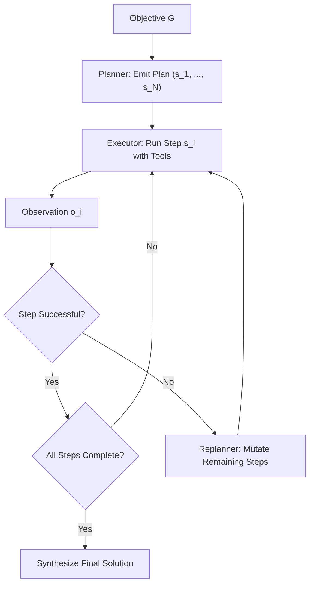
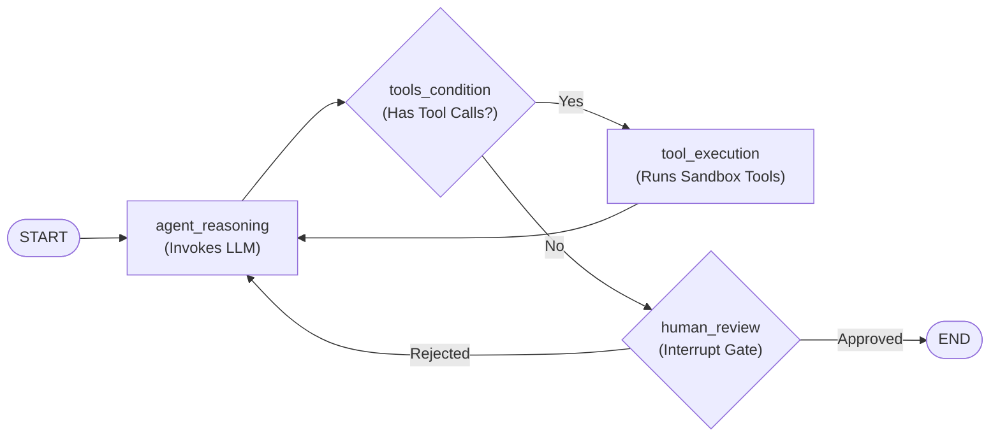
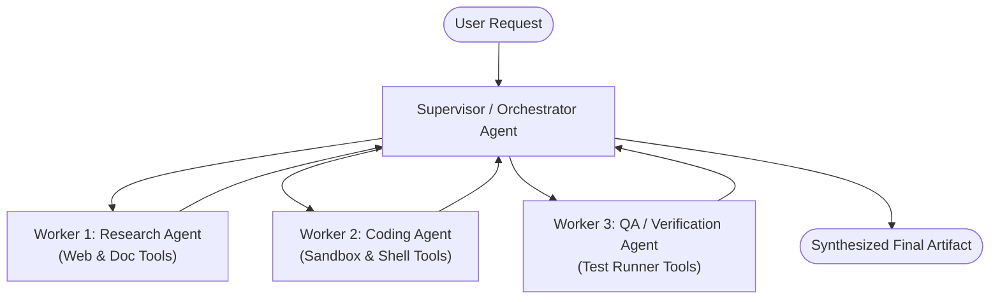
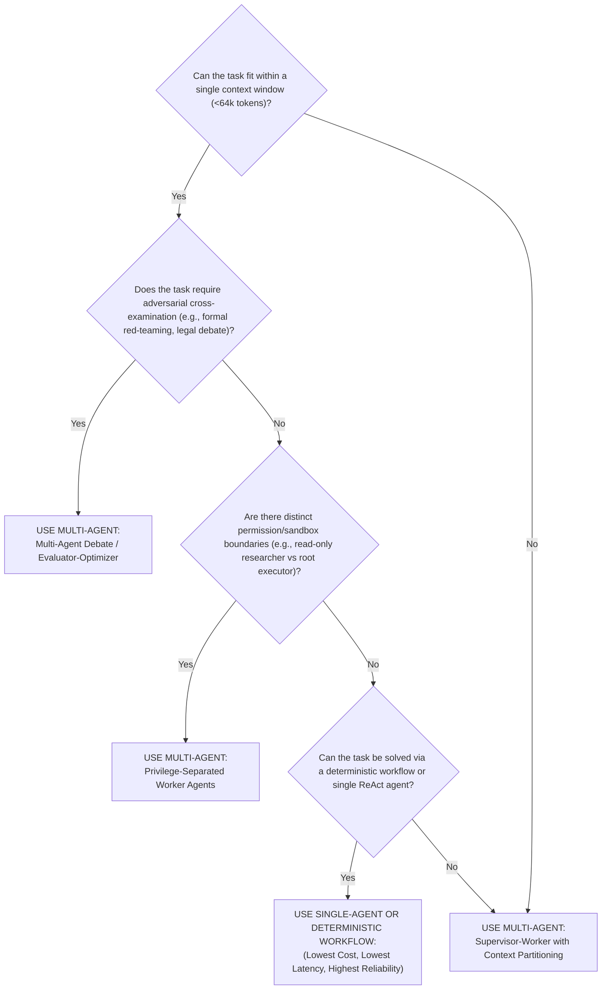

# Agent System Topologies: Single-Agent Control Loops, StateGraphs, and Multi-Agent Coordination Dynamics

**Author:** Senior Principal Agentic AI Researcher & Distributed Autonomous Systems Architect  
**Scope:** Single-Agent Control Flows, Cyclic StateGraphs, Multi-Agent Coordination Topologies, Consensus Protocols, and Empirical Reliability Analysis  
**Status:** University-Level Reference Manual & Production Architectural Guide  

---

## 1. Single-Agent Topologies & Control Flows

### 1.1 Architectural Taxonomy
Single-agent control flows govern how an autonomous cognitive engine sequences deliberation, tool calls, and state transitions.

```
+------------------------------------------------------------------------------------+
|                         SINGLE-AGENT CONTROL FLOW TAXONOMY                         |
+------------------------------------------------------------------------------------+
       |
       +---> 1. Direct ReAct Loop (Step-by-step reactive execution)
       |
       +---> 2. Router / Dispatcher Pattern (Intent classification & specialized execution)
       |
       +---> 3. Planner-Executor Architecture (Upfront decomposition & iterative execution)
       |
       +---> 4. Evaluator-Optimizer / Critic Loop (Dual-model generative refinement)
       |
       +---> 5. State Machine / Graph-Based Agent (LangGraph / StateGraph cyclic flows)
```

#### 1.1.1 The Router / Dispatcher Pattern
A lightweight classifier parses an input prompt $x$ and maps it to one of $K$ specialized execution branches:

$$k^* = \arg\max_{k \in \{1, \dots, K\}} P_\theta(\text{route}_k \mid x)$$

*Characteristics:* Low latency, deterministic isolation, zero risk of infinite loops, but completely incapable of dynamic multi-domain tasks requiring cross-branch synthesis.

#### 1.1.2 The Planner-Executor (Plan-and-Solve-and-Replan) Pattern
Splits responsibility into two specialized cognitive entities:
1. **Planner Agent ($\pi_{\text{plan}}$):** Given global objective $G$, generates high-level plan $\mathcal{P} = (s_1, s_2, \dots, s_N)$.
2. **Executor Agent ($\pi_{\text{exec}}$):** Sequentially executes step $s_i$ using tools, updating execution record $\mathcal{E}$.
3. **Replanner ($\pi_{\text{replan}}$):** Evaluates $(\mathcal{P}, \mathcal{E}, o_i)$. If step $s_i$ fails or yields unexpected environmental feedback, $\pi_{\text{replan}}$ dynamically mutates remaining steps $(s_{i+1}, \dots, s_N)$.



---

## 2. State Machine & Graph-Based Agents (LangGraph / StateGraph)

### 2.1 Computational Model: Directed Cyclic Graphs with Explicit State Channels
Production agents require structured control flows with cyclic looping, deterministic guardrails, state checkpointing, and human-in-the-loop interruption. Linear chains and unconstrained loops fail in production due to lack of observability and inability to rewind.

A **StateGraph** agent is formally defined as a directed, potentially cyclic attributed graph:

$$\mathcal{G} = \langle \mathcal{S}, \mathcal{V}, \mathcal{E}, v_0, \mathcal{V}_{\text{terminal}}, \mathcal{R} \rangle$$

Where:
* $\mathcal{S}$ is the shared State Schema (defined via Pydantic or TypedDict).
* $\mathcal{V}$ is the set of computational nodes, where each node $v \in \mathcal{V}$ is a pure or impure state transformation function:
  $$f_v: \mathcal{S} \rightarrow \Delta \mathcal{S}$$
* $\mathcal{R}$ is the set of reducer functions associated with state keys (e.g., `operator.add` for message appending, replace for scalar overrides).
* $\mathcal{E}$ is the set of directed edges, partitioned into:
  * **Standard Edges:** Unconditional transitions $e = (u, v)$.
  * **Conditional Edges:** Dynamic routing functions $g: \mathcal{S} \rightarrow \mathcal{V}$ that evaluate current state and return the target node name.
* $v_0 \in \mathcal{V}$ is the entry point node (`START`).
* $\mathcal{V}_{\text{terminal}} \subseteq \mathcal{V}$ is the set of exit nodes (`END`).



### 2.2 Checkpointing, Time-Travel, and Fault Tolerance
In production state graphs:
* Every node transition commits a snapshot of $\mathcal{S}_t$ to a durable persistence checkpointer (PostgreSQL / Redis / SQLite).
* **Time-Travel:** Developers or supervisory agents can rewind execution to checkpoint $t - k$, mutate state variables (e.g., correcting an errant observation), and re-fork execution along an alternate trajectory.
* **Human-in-the-loop (HITL):** Nodes can declare `interrupt_before` or `interrupt_after`, halting execution indefinitely until an external cryptographic payload resumes the thread.

### 2.3 Concrete StateGraph Implementation

```python
"""
Robust Cyclic StateGraph Agent Implementation with Checkpointing & Routing
"""
from typing import TypedDict, Annotated, List, Dict, Any, Literal
import operator
from dataclasses import dataclass

# 1. Explicit State Schema with Reducer Annotations
class AgentState(TypedDict):
    messages: Annotated[List[Dict[str, str]], operator.add]
    extracted_data: Dict[str, Any]
    iteration_count: int
    is_authorized: bool

# 2. Mock Computational Nodes
def agent_reasoning_node(state: AgentState) -> Dict[str, Any]:
    """Generates next action or final answer."""
    current_iter = state.get("iteration_count", 0) + 1
    recent_messages = state["messages"]
    
    # Check if tool invocation is needed (simulated logic)
    if "data" not in state.get("extracted_data", {}) and current_iter < 3:
        return {
            "messages": [{"role": "assistant", "content": "CALL_TOOL: fetch_customer_record(id=101)"}],
            "iteration_count": current_iter
        }
    else:
        return {
            "messages": [{"role": "assistant", "content": "FINAL_ANSWER: Customer balance is $4,250."}],
            "iteration_count": current_iter
        }

def tool_execution_node(state: AgentState) -> Dict[str, Any]:
    """Executes external tool in sandbox."""
    last_msg = state["messages"][-1]["content"]
    # Simulated execution
    return {
        "messages": [{"role": "user", "content": "OBSERVATION: Customer record 101 found: Balance $4,250"}],
        "extracted_data": {"data": {"customer_id": 101, "balance": 4250}}
    }

# 3. Conditional Routing Predicate
def route_next_step(state: AgentState) -> Literal["tools", "end"]:
    last_message = state["messages"][-1]["content"]
    if "CALL_TOOL" in last_message:
        return "tools"
    return "end"

# 4. StateGraph Execution Driver
class RobustStateGraphEngine:
    def __init__(self):
        self.nodes = {
            "agent": agent_reasoning_node,
            "tools": tool_execution_node
        }
        self.checkpoints: List[AgentState] = []

    def run(self, initial_state: AgentState, max_loops: int = 10) -> AgentState:
        current_state = initial_state
        current_node = "agent"
        
        for _ in range(max_loops):
            # Checkpoint durable state
            self.checkpoints.append(dict(current_state))
            
            # Execute current node
            node_fn = self.nodes[current_node]
            delta = node_fn(current_state)
            
            # Apply Reducer Functions
            for key, val in delta.items():
                if key == "messages":
                    current_state["messages"] = current_state["messages"] + val
                else:
                    current_state[key] = val
                    
            # Evaluate Transitions
            if current_node == "agent":
                decision = route_next_step(current_state)
                if decision == "tools":
                    current_node = "tools"
                else:
                    break
            elif current_node == "tools":
                current_node = "agent"
                
        return current_state
```

---

## 3. Multi-Agent Systems (MAS): Coordination Topologies

Multi-Agent Systems decompose complex workflows across multiple specialized agents, each possessing an isolated system prompt, tailored tool registry, and bounded working memory.

```
+-------------------------------------------------------------------------------+
|                       MULTI-AGENT COORDINATION TOPOLOGIES                     |
+-------------------------------------------------------------------------------+
       |
       +---> 1. Supervisor-Worker (Hierarchical Hub-and-Spoke)
       |
       +---> 2. Swarm / Peer-to-Peer (Decentralized Handoff)
       |
       +---> 3. Multi-Agent Debate & Consensus (Adversarial Verification)
       |
       +---> 4. Sequential Assembly Line (Artifact Pipeline)
```

### 3.1 Supervisor-Worker (Hierarchical Hub-and-Spoke)
A central Orchestrator/Supervisor agent intercepts incoming user requests, manages high-level task decomposition, delegates subtasks to subordinate worker agents (e.g., Coder, Tester, Researcher), and synthesizes worker outputs.



* **State Boundary:** Subordinate workers do NOT share context directly. Each worker runs in an isolated context window, preventing context saturation.
* **Control Mechanism:** The supervisor invokes workers via tool calls (e.g., `delegate_to_worker(worker_id="coder", task="...")`).

---

### 3.2 Swarm / Peer-to-Peer Dynamic Handoff (OpenAI Swarm Pattern)
In a peer-to-peer swarm, there is no central orchestrator. Agency is decentralized: each agent can dynamically transfer control to any other agent by returning a specialized handoff function:

```python
def transfer_to_triage_agent():
    """Handoff execution control to Triage Agent."""
    return HandoffResult(agent=triage_agent)

def transfer_to_billing_agent():
    """Handoff execution control to Billing Agent."""
    return HandoffResult(agent=billing_agent)
```

#### The Dynamic Handoff Loop
1. The currently active agent executes its ReAct loop.
2. If the user request exceeds its domain boundary, it invokes a handoff function.
3. The runtime intercepts the handoff, swaps the active agent definition (system prompt and tool registry), and feeds the interaction history to the newly designated agent.

*Failure Mode:* **Infinite Delegation Ping-Pong.** Agent A delegates to Agent B, which detects an edge case and delegates back to Agent A, consuming budget in an infinite cycle. Production swarms require a global Handoff Depth Counter ($D_{\text{handoff}} \le 4$).

---

### 3.3 Multi-Agent Debate & Consensus (Du et al., 2023)

#### 3.3.1 Theoretical Formulation
Du et al. (*Improving Factuality and Reasoning in Language Models through Multiagent Debate*, 2023) and Liang et al. (*Encouraging Divergent Thinking in Large Language Models through Multi-Agent Debate*, 2023) established that deploying multiple instances of LLMs to independently generate solutions and iteratively debate their mutual outputs significantly suppresses hallucinations and improves reasoning on GSM8K and MATH.

```
Round 0: Independent Generation
[ Agent 1: Proposes Solution S_1^0 ]      [ Agent 2: Proposes Solution S_2^0 ]

Round 1: Cross-Critique & Refinement
[ Agent 1: Reads S_2^0 -> Emits S_1^1 ]   [ Agent 2: Reads S_1^0 -> Emits S_2^1 ]

Round R: Consensus Check / Majority Voting
               |                                       |
               +-------------------> [ Consensus Module ] ---> Final Verified Solution
```

Mathematically, let $N$ be the number of debating agents and $R$ be the number of debate rounds. At round $r = 0$:

$$y_i^{(0)} \sim \pi_i(y \mid x), \quad \forall i \in \{1, \dots, N\}$$

At round $r \in \{1, \dots, R\}$, agent $i$ conditions on the collective outputs of all agents from round $r-1$:

$$y_i^{(r)} \sim \pi_i\left(y \;\middle|\; x, \left\{ y_j^{(r-1)} \right\}_{j=1}^N \right)$$

Termination occurs when consensus is reached:

$$\forall j, k \in \{1, \dots, N\}, \quad \text{Similarity}\left(y_j^{(R)}, y_k^{(R)}\right) \ge 1 - \epsilon$$

Or via a judge agent computing majority vote over $\{ y_i^{(R)} \}_{i=1}^N$.

---

## 4. Message Routing, State Sharing, and Protocols

### 4.1 Shared Blackboard vs. Isolated Actor Mailboxes

```
      SHARED BLACKBOARD ARCHITECTURE                 ISOLATED ACTOR / MAILBOX ARCHITECTURE

       +-------------------------+                   [Agent A]                  [Agent B]
       |    GLOBAL BLACKBOARD    |                  (Private S_A)              (Private S_B)
       | (Shared Context/State)  |                        |                          ^
       +-------------------------+                        | Structured Message       |
         ^         ^         ^                            +--------------------------+
         |         |         |                                  (Envelopes via Bus)
     [Agent A] [Agent B] [Agent C]
```

| Dimension | Shared Blackboard Architecture | Isolated Actor / Mailbox Architecture |
| :--- | :--- | :--- |
| **State Scope** | Global, centralized state accessible to all agents | Private, local state encapsulated within each agent |
| **Context Growth** | $O(N \cdot M)$ tokens (scales linearly with total team turns) | $O(M_{\text{local}})$ tokens (strictly bounded per agent) |
| **Race Conditions** | High (agents overwrite shared variables simultaneously) | None (asynchronous message queues with mailbox serialization) |
| **Fault Isolation** | Poor (a single hallucinated message corrupts global context) | High (corrupted messages can be rejected by receiving agent) |
| **Implementation** | Central database / shared state dictionary | Message broker (RabbitMQ / Redis Streams / LangGraph A2A) |

### 4.2 Standardized Agent-to-Agent (A2A) Message Envelope Specification

To prevent communication degradation, multi-agent interactions must adhere to an explicit, typed message schema:

```json
{
  "$schema": "https://json-schema.org/draft/2020-12/schema",
  "title": "AgentMessageEnvelope",
  "type": "object",
  "properties": {
    "message_id": { "type": "string", "format": "uuid" },
    "correlation_id": { "type": "string", "format": "uuid" },
    "sender": {
      "type": "object",
      "properties": {
        "agent_id": { "type": "string" },
        "role": { "type": "string" }
      },
      "required": ["agent_id", "role"]
    },
    "recipient": {
      "type": "object",
      "properties": {
        "agent_id": { "type": "string" },
        "broadcast": { "type": "boolean", "default": false }
      },
      "required": ["agent_id"]
    },
    "intent": {
      "type": "string",
      "enum": ["TASK_DELEGATION", "TASK_RESULT", "CRITIQUE_REQUEST", "CRITIQUE_RESPONSE", "HANDOFF", "ABORT"]
    },
    "payload": {
      "type": "object",
      "description": "Domain-specific input or output artifacts"
    },
    "token_budget_remaining": { "type": "integer" },
    "timestamp_utc": { "type": "string", "format": "date-time" }
  },
  "required": ["message_id", "correlation_id", "sender", "recipient", "intent", "payload", "timestamp_utc"]
}
```

---

## 5. Multi-Agent Failure Modes, Latency Penalties, and Error Cascades

### 5.1 The Mathematical Compounding of Error: $p^N$ Degradation
In a sequential multi-agent assembly line of $N$ dependent agents, let $p_i$ be the probability that agent $i$ correctly performs its assigned subtask. Assuming independent step probabilities:

$$P(\text{System Success}) = \prod_{i=1}^N p_i$$

Even if individual agents operate at a formidable $p_i = 0.90$ (90% reliability):
* 3-Agent Pipeline: $P(\text{Success}) = 0.90^3 = 0.729$ (72.9%)
* 6-Agent Pipeline: $P(\text{Success}) = 0.90^6 = 0.531$ (53.1%)
* 10-Agent Pipeline: $P(\text{Success}) = 0.90^{10} = 0.348$ (34.8%)

**Crucial Insight:** Unregulated multi-agent chaining rapidly degrades end-to-end task completion below that of a single, well-scaffolded agent.

```
Reliability
  1.0 +---\
      |    \---
  0.8 |        \--- p_i = 0.95
      |            \---
  0.6 |                \--- p_i = 0.90
      |                    \---
  0.4 |                        \--- p_i = 0.85
      |                            \---
  0.2 +-------------------------------------------------
      1    2    3    4    5    6    7    8    9    10
                  Number of Sequential Agents (N)
```

### 5.2 Specific Multi-Agent Failure Modes

1. **Sycophancy and Groupthink in Debate:** Rather than critiquing flawed logic, models (especially alignment-tuned models) exhibit strong social compliance biases, rapidly converging on whatever incorrect answer was confidently asserted by the first agent in round 0.
2. **Semantic Telephone Game (Information Decay):** When passing natural language summaries across 4+ agents, subtle constraints (e.g., *"do not modify lines 40-50"*) are progressively pruned or misconstrued by intermediary agents, resulting in catastrophic downstream specification violations.
3. **Context Window Multiplication & Economic Explosion:** Running $N$ agents over $K$ debate rounds with context lengths $L$ scales token consumption as $O(N \cdot K \cdot L)$. A single task can consume over $1.5\text{M tokens}$, inflating per-task costs by $20\times - 100\times$ without commensurate accuracy gains.
4. **Latency Floor Violation:** Serial multi-agent execution turns sub-second operations into multi-minute batch jobs. In customer-facing production systems, p95 latency bounds ($< 3\text{ seconds}$) render multi-agent architectures fundamentally non-viable.

---

## 6. Empirical Evaluation: When Multi-Agent Wins vs. When It Is an Anti-Pattern

### 6.1 Empirical Evidence from Software Engineering Benchmarks (SWE-bench)

The empirical literature on SWE-bench provides definitive guidance on the single-agent vs. multi-agent question:

* **ChatDev (Sun et al., 2023) / MetaGPT (Hong et al., 2023):** Simulated complete multi-agent software companies (CEO, CTO, Programmer, Tester). While producing visually impressive conversational logs, early evaluations on rigorous, real-world benchmarks like SWE-bench achieved low resolution rates ($< 10\%$) due to error compounding and role-play distraction.
* **SWE-agent (Yang et al., 2024):** Employed a **single autonomous agent** equipped with an Agent-Computer Interface (ACI) tailored specifically for searching, browsing, and editing code. Achieved state-of-the-art results ($> 18\%$ on SWE-bench Lite at launch).
* **Agentless (Xia et al., 2024):** Specifically removed all multi-agent simulation overhead and autonomous ReAct looping. Utilized a **hierarchical two-phase deterministic pipeline** (Fault Localization via retrieval $\rightarrow$ Single-shot Repair $\rightarrow$ Unit Test Verification). Agentless matched or exceeded the performance of complex multi-agent frameworks at **a fraction of the cost ($<\$0.35$ per issue)**.

### 6.2 Architectural Decision Rubric: Single vs. Multi-Agent



#### Summary Decision Table

| System Criterion | Recommend Single-Agent / Deterministic Workflow | Recommend Multi-Agent System (MAS) |
| :--- | :--- | :--- |
| **Context Window** | Task fits comfortably in $< 64\text{K tokens}$ | Task exceeds $128\text{K tokens}$, requiring context sharding |
| **Tool Count** | $< 15$ tools (easily indexed or retrieved) | $> 50$ tools across conflicting, isolated domains |
| **Latency Requirement** | Real-time / Synchronous ($< 5\text{ seconds}$) | Batch / Asynchronous (minutes to hours acceptable) |
| **Cost Sensitivity** | High ($< \$0.05$ per run budget) | Low (solving high-value enterprise problems, budget $> \$2.00$) |
| **Security Boundaries** | Unified security profile | Multiple privilege rings (e.g., Guest vs Admin sandboxes) |
| **Failure Tolerance** | Zero-tolerance for cascading degradation | Workflows with automated unit test or compiler validation gates |

---

## 7. Primary Literature Citations

1. **Du, Y., Li, S., Torralba, A., Tenenbaum, J. B., & Mordatch, I. (2023).** *Improving Factuality and Reasoning in Language Models through Multiagent Debate.* arXiv preprint arXiv:2305.14325.
2. **Liang, T., He, Z., Jiao, W., Wang, X., Wang, Y., Wang, R., ... & Tu, Z. (2023).** *Encouraging Divergent Thinking in Large Language Models through Multi-Agent Debate.* arXiv preprint arXiv:2305.19118.
3. **Hong, S., Zheng, X., Chen, J., Cheng, Y., Zhang, C., Wang, Z., ... & Zhou, M. (2023).** *MetaGPT: Meta Programming for A Multi-Agent Collaborative Framework.* International Conference on Learning Representations (ICLR 2024).
4. **Sun, C., Han, S., Deng, Z., Fu, T. J., & Lu, H. (2023).** *ChatDev: Communicative Agents for Software Development.* arXiv preprint arXiv:2307.07924.
5. **Yang, J., Jimenez, C. E., Wettig, A., Lieret, K., Yao, S., Narasimhan, K., & Press, O. (2024).** *SWE-agent: Agent-Computer Interfaces Enable Automated Software Engineering.* arXiv preprint arXiv:2405.15793.
6. **Xia, C. S., Deng, Y., Dunn, S., & Zhang, L. (2024).** *Agentless: Demystifying LLM-based Software Engineering.* arXiv preprint arXiv:2407.01489.
7. **OpenAI. (2024).** *Swarm: An Educational Framework for Ergonomic Multi-Agent Orchestration.* OpenAI Open Source Release.
8. **LangChain. (2024).** *LangGraph: Building Language Agents as Graphs.* LangChain Open Source Documentation and Architecture.
