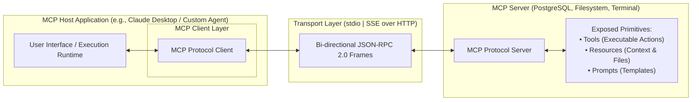
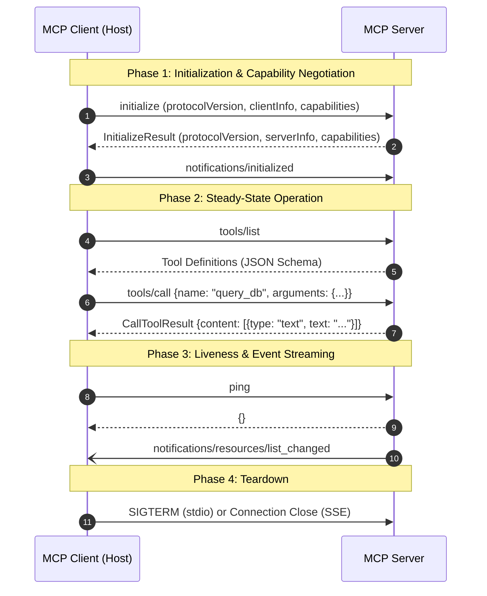
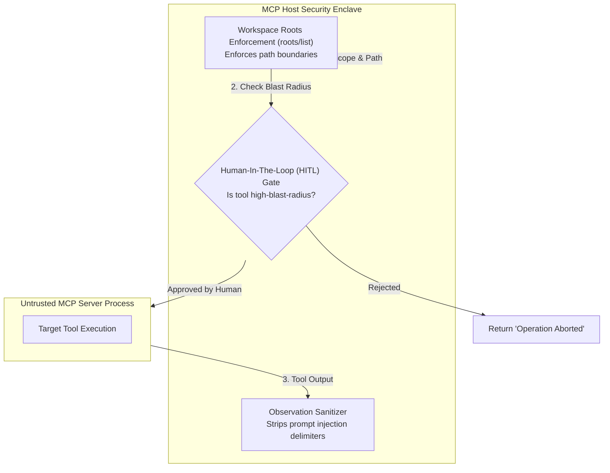
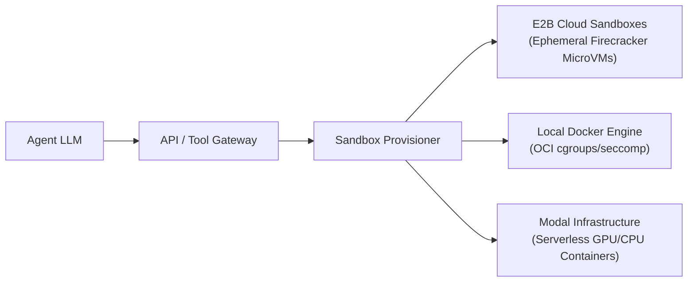

# Model Context Protocol (MCP) and Production Agent Infrastructure

**Author:** Senior Principal Agentic AI Researcher & Distributed Autonomous Systems Architect  
**Scope:** Model Context Protocol (MCP) Specification, JSON-RPC 2.0 Transports, Client-Server Topologies, Security Sandboxing, and Production Infrastructure  
**Status:** University-Level Reference Manual & Production Architectural Guide  

---

## 1. Model Context Protocol (MCP) Overview & Architecture

### 1.1 The "M $\times$ N" Integration Dilemma
Historically, connecting $M$ distinct Foundation Model clients (e.g., Claude, ChatGPT, Cursor, local agent runtimes) to $N$ diverse enterprise tools and data sources (e.g., PostgreSQL, GitHub, Jira, local filesystems, Slack) required building $M \times N$ custom point-to-point integrations:

```
Point-to-Point Architecture (M x N Complexity):
  [Claude]  ------->  [PostgreSQL]
  [ChatGPT] ------->  [GitHub API]
  [Cursor]  ------->  [Local Filesystem]
  [Agents]  ------->  [Jira Service]

Decoupled Standard Architecture with MCP (M + N Complexity):
  [Claude]   \                                         /  [PostgreSQL Server]
  [ChatGPT]   --- [ MCP CLIENT ] <--> [ MCP SERVER ] ---  [GitHub Server]
  [Cursor]    --- [ INTERFACE  ]      [  PROTOCOL   ] --- [Filesystem Server]
  [Custom App]/                                        \  [Jira Server]
```

Introduced by Anthropic in November 2024, the **Model Context Protocol (MCP)** standardizes how applications provide context and capabilities to LLMs. MCP decouples model frontends from data sources, reducing the integration surface from $O(M \times N)$ to $O(M + N)$.

### 1.2 The Three-Tier Architecture: Host, Client, and Server



1. **MCP Host:** The runtime environment running the AI application (e.g., Claude Desktop, Cursor IDE, autonomous agent backend). The Host orchestrates multiple MCP Clients.
2. **MCP Client:** An internal protocol adapter within the Host that maintains a dedicated, stateful connection to a single MCP Server.
3. **MCP Server:** An independent, modular service process (local binary or remote microservice) that exposes tools, data resources, and prompt templates through the standardized protocol.

---

## 2. Protocol Specification & Wire Format

### 2.1 Base Protocol: JSON-RPC 2.0
MCP is strictly built on top of **JSON-RPC 2.0** (RFC specifications). All communication consists of three message varieties:
1. **Requests:** Expecting a correlated response.
   ```json
   { "jsonrpc": "2.0", "id": "req-001", "method": "tools/call", "params": { ... } }
   ```
2. **Responses:** Correlated by `id` to the initial request.
   ```json
   { "jsonrpc": "2.0", "id": "req-001", "result": { ... } }
   ```
3. **Notifications:** One-way fire-and-forget messages containing no `id`.
   ```json
   { "jsonrpc": "2.0", "method": "notifications/resources/updated", "params": { ... } }
   ```

### 2.2 Transport Mechanisms

MCP defines two official transport layers:

```
+-------------------------------------------------------------------------------+
|                             MCP TRANSPORT LAYERS                              |
+-------------------------------------------------------------------------------+
       |
       +---> 1. Standard Input/Output (stdio)
       |       - High-speed local Inter-Process Communication (IPC).
       |       - The Host spawns the Server binary as a child subprocess.
       |       - Frames are delimited by newlines (`\n`).
       |       - Ephemeral lifecycle tied directly to the parent process.
       |
       +---> 2. Server-Sent Events (SSE) over HTTP
               - Distributed, network-addressable architecture.
               - Server-to-Client: Long-lived streaming HTTP GET connection (`text/event-stream`).
               - Client-to-Server: Discrete HTTP POST requests targeting endpoint.
               - Used for remote microservices, cloud sandboxes, and enterprise clusters.
```

### 2.3 Connection Lifecycle & Handshake Flow



#### Initialization Wire Trace Example

**Client Request (`initialize`):**
```json
{
  "jsonrpc": "2.0",
  "id": 1,
  "method": "initialize",
  "params": {
    "protocolVersion": "2024-11-05",
    "capabilities": {
      "roots": { "listChanged": true },
      "sampling": {}
    },
    "clientInfo": {
      "name": "EnterpriseAgentController",
      "version": "1.4.0"
    }
  }
}
```

**Server Response:**
```json
{
  "jsonrpc": "2.0",
  "id": 1,
  "result": {
    "protocolVersion": "2024-11-05",
    "capabilities": {
      "tools": { "listChanged": true },
      "resources": { "subscribe": true, "listChanged": true },
      "prompts": { "listChanged": true }
    },
    "serverInfo": {
      "name": "SecurePostgresConnector",
      "version": "2.1.0"
    }
  }
}
```

---

## 3. The Core MCP Primitives

MCP decomposes system interaction into three core primitives, plus an advanced inverse communication primitive:

```
+-------------------------------------------------------------------------------+
|                            CORE MCP PRIMITIVES                                |
+-------------------------------------------------------------------------------+
       |
       +---> 1. Tools: Executable actions controlled by the model (tools/call)
       |
       +---> 2. Resources: Passive, read-only data & context (resources/read)
       |
       +---> 3. Prompts: Pre-structured templates controlled by the user (prompts/get)
       |
       +---> 4. Sampling: Server-initiated LLM completions (sampling/createMessage)
```

### 3.1 Tools: Executable Actions Controlled by the Model
Tools enable the model to execute operations with side-effects or compute in the server's environment:
* Discovery: `tools/list` returns an array of tool descriptors with full JSON Schema definitions.
* Invocation: `tools/call` passes arguments and returns a structured `content` array (text, images, or embedded resource representations).

```json
{
  "name": "execute_bash",
  "description": "Executes an arbitrary shell command in the secure Linux container.",
  "inputSchema": {
    "type": "object",
    "properties": {
      "command": { "type": "string", "description": "The command string to execute." },
      "timeout_ms": { "type": "integer", "default": 5000 }
    },
    "required": ["command"]
  }
}
```

### 3.2 Resources: Read-Only Context Controlled by the Application
Resources represent passive, contextual data that does not cause execution side effects (e.g., local files, database records, API specifications):
* URI Scheme: Resources are addressed via uniform URIs (e.g., `file:///app/config.json`, `postgres://schema/users/schema`).
* Dynamic Subscriptions: Clients can subscribe (`resources/subscribe`) to receive push notifications (`notifications/resources/updated`) when underlying data changes.

### 3.3 Prompts: Reusable Workflows Controlled by the User
Prompts are parameterized templates exposed by the server to guide the LLM through specialized workflows (e.g., `git-commit-generator`, `sql-migration-reviewer`).

### 3.4 Sampling: Server-Initiated LLM Invocations
A crucial capability of MCP is **Sampling** (`sampling/createMessage`). This allows an MCP Server to ask the MCP Host to perform an LLM completion on its behalf.
* *Use Case:* An MCP Server managing a complex database schema can use sampling to translate a natural language query into optimized SQL internally before returning the raw data to the primary agent, maintaining encapsulation.

---

## 4. Security, Sandboxing, and Permission Boundaries

### 4.1 Threat Model for Agent Protocols

```
+-------------------------------------------------------------------------------+
|                            MCP THREAT TAXONOMY                                |
+-------------------------------------------------------------------------------+
       |
       +---> 1. Malicious / Rogue MCP Server
       |       - Exposes tools that execute malicious code on the host.
       |       - Returns prompt-injection payloads via tool observations or resources.
       |
       +---> 2. Confused Deputy Attack
       |       - LLM receives untrusted user text that tricks it into invoking an
       |         authorized administrative tool (e.g., `delete_database_cluster`).
       |
       +---> 3. Directory Traversal & Resource Exfiltration
               - Server attempts to read files outside the approved workspace root.
```

### 4.2 Architectural Defenses & Least Privilege



1. **Roots Specification (`roots/list`):** The Host explicitly declares the root URIs (e.g., `file:///workspace/project-a/`) that the server is permitted to access. Any file access outside these boundaries triggers a protocol exception.
2. **Mandatory Human-in-the-Loop (HITL) Gates:** High-risk tool calls (file deletion, network egress, credential access) require cryptographic human authorization before the client transmits `tools/call`.
3. **Indirect Prompt Injection Defense:** Observations returned from MCP Servers must be treated as untrusted text, enclosed within strict boundary delimiters (e.g., `<mcp_observation_sandbox>`), and scanned for adversarial jailbreak sequences.

---

## 5. Architectural Comparison: MCP vs. Alternatives

| Dimension | Model Context Protocol (MCP) | OpenAI Function Calling | OpenAPI / ChatGPT Plugins | Traditional REST / gRPC |
| :--- | :--- | :--- | :--- | :--- |
| **Architectural Role** | Open universal context & tool bus | Vendor-specific API feature | Vendor-specific extension format | Raw transport protocol |
| **Transport** | stdio (local IPC) & SSE (HTTP) | HTTPS REST | HTTPS REST | TCP / HTTP/2 |
| **Wire Protocol** | JSON-RPC 2.0 | JSON payloads | JSON / YAML specification | Protobuf / JSON |
| **Statefulness** | Stateful (sessions, subscriptions) | Stateless per HTTP turn | Stateless per HTTP turn | Configurable |
| **Primitives** | Tools, Resources, Prompts, Sampling | Tools only | Tools / Endpoints | Arbitrary RPC methods |
| **Bidirectionality**| Full (Server can trigger Sampling) | Unidirectional (Client calls model) | Unidirectional | Bidirectional (in gRPC) |
| **Ecosystem Decoupling**| High (runs across any LLM/client)| Zero (locked to OpenAI endpoints) | Locked to OpenAI ecosystem | High (requires manual integration) |

---

## 6. Modern Production Agent Execution Infrastructure

### 6.1 Secure Execution Sandboxes

Running code emitted by autonomous agents requires virtualization that delivers sub-second spin-up times with hardware-grade multi-tenant isolation:



#### 6.1.1 E2B (Ephemeral Firecracker MicroVMs)
* **Architecture:** Dedicated hardware-isolated microVMs booted in $< 150\text{ ms}$.
* **Filesystem:** Ephemeral stateful Debian environment with pre-installed language kernels (Python, Node.js, Bash).
* **Network Isolation:** Sandboxes run with strict egress controls, preventing SSRF (Server-Side Request Forgery) attacks on internal cloud metadata endpoints (`169.254.169.254`).

---

### 6.2 Observability, Tracing, and Telemetry

Autonomous agents exhibit complex, branching, and emergent behaviors that cannot be debugged with standard log aggregation. Production systems require **Distributed Agent Tracing** conforming to OpenTelemetry GenAI standards:

```
[ Root Trace: Agent Execution (Session f8c6afe6) ]
   |
   +---> [ Span 1: Intent Classification (LLM Call, 450ms) ]
   |
   +---> [ Span 2: ReAct Loop Step 1 (Loop Node) ]
   |        |
   |        +---> [ Sub-Span 2.1: Plan Deliberation (LLM Call, 850ms) ]
   |        +---> [ Sub-Span 2.2: MCP Tool Call: execute_sql (stdio, 120ms) ]
   |        +---> [ Sub-Span 2.3: Observation Ingestion & Token Count ]
   |
   +---> [ Span 3: Reflexion Evaluation (LLM Call, 600ms) ]
```

#### Production Observability Platforms
* **Langfuse / Arize Phoenix / LangSmith:** Open-source and enterprise tracing engines capturing token expenditures, full prompt/response generations, tool call latency, and cost per session.
* **Semantic Evaluation:** Automated LLM-as-a-Judge spans running asynchronously to score hallucination rates, tool selection precision, and policy compliance.

---

### 6.3 Reliability Engineering: Rate Limiting & Circuit Breakers

```python
"""
Production Agent Circuit Breaker & Budget Guard
"""
import time
from typing import Dict, Any

class AgentCircuitBreaker:
    def __init__(self, max_tokens: int = 100_000, max_cost_usd: float = 2.00, max_consecutive_tool_failures: int = 3):
        self.max_tokens = max_tokens
        self.max_cost_usd = max_cost_usd
        self.max_consecutive_tool_failures = max_consecutive_tool_failures
        
        self.accumulated_tokens = 0
        self.accumulated_cost = 0.0
        self.consecutive_failures = 0
        self.is_tripped = False
        self.trip_reason = ""

    def record_step(self, tokens: int, cost_usd: float, tool_success: bool):
        self.accumulated_tokens += tokens
        self.accumulated_cost += cost_usd

        if not tool_success:
            self.consecutive_failures += 1
        else:
            self.consecutive_failures = 0

        # Evaluate Trip Invariants
        if self.accumulated_tokens >= self.max_tokens:
            self._trip("TokenBudgetExceeded")
        elif self.accumulated_cost >= self.max_cost_usd:
            self._trip("CostCeilingExceeded")
        elif self.consecutive_failures >= self.max_consecutive_tool_failures:
            self._trip("ConsecutiveToolFailureThresholdReached")

    def _trip(self, reason: str):
        self.is_tripped = True
        self.trip_reason = reason
        # In production: Emits alerting event to PagerDuty/Datadog and interrupts agent execution

    def check_healthy(self):
        if self.is_tripped:
            raise RuntimeError(f"CircuitBreakerTripped: Agent execution aborted due to {self.trip_reason}")
```

---

## 7. Complete Reference MCP Server Implementation

The following complete Python implementation exposes a secure, sandboxed mathematical calculation tool conforming to the full Model Context Protocol JSON-RPC specification over `stdio`:

```python
"""
Complete Production-Grade MCP Server conforming to Model Context Protocol (2024-11-05) over stdio.
"""
import sys
import json
import math
from typing import Dict, Any

def handle_initialize(request_id: Any) -> Dict[str, Any]:
    return {
        "jsonrpc": "2.0",
        "id": request_id,
        "result": {
            "protocolVersion": "2024-11-05",
            "capabilities": {
                "tools": {"listChanged": False},
                "resources": {},
                "prompts": {}
            },
            "serverInfo": {
                "name": "SecureMathMCPServer",
                "version": "1.0.0"
            }
        }
    }

def handle_tools_list(request_id: Any) -> Dict[str, Any]:
    return {
        "jsonrpc": "2.0",
        "id": request_id,
        "result": {
            "tools": [
                {
                    "name": "compute_expression",
                    "description": "Evaluates a mathematically safe arithmetic expression without arbitrary code execution risks.",
                    "inputSchema": {
                        "type": "object",
                        "properties": {
                            "expression": {
                                "type": "string",
                                "description": "Mathematical expression, e.g., 'sqrt(144) + 42 * 2'"
                            }
                        },
                        "required": ["expression"]
                    }
                }
            ]
        }
    }

def handle_tools_call(request_id: Any, params: Dict[str, Any]) -> Dict[str, Any]:
    name = params.get("name")
    arguments = params.get("arguments", {})

    if name != "compute_expression":
        return {
            "jsonrpc": "2.0",
            "id": request_id,
            "error": {
                "code": -32601,
                "message": f"Method '{name}' not found."
            }
        }

    expression = arguments.get("expression", "")
    safe_locals = {"sqrt": math.sqrt, "sin": math.sin, "cos": math.cos, "pi": math.pi, "pow": math.pow}

    try:
        # Safe mathematical evaluation restricted to pure math primitives
        # (In production, use ast.parse for complete AST node whitelist)
        result = eval(expression, {"__builtins__": None}, safe_locals)
        return {
            "jsonrpc": "2.0",
            "id": request_id,
            "result": {
                "content": [
                    {
                        "type": "text",
                        "text": f"Result: {result}"
                    }
                ],
                "isError": False
            }
        }
    except Exception as e:
        return {
            "jsonrpc": "2.0",
            "id": request_id,
            "result": {
                "content": [
                    {
                        "type": "text",
                        "text": f"Evaluation Error: {str(e)}"
                    }
                ],
                "isError": True
            }
        }

def run_stdio_mcp_server():
    """Main Event Loop processing JSON-RPC messages over standard input."""
    while True:
        line = sys.stdin.readline()
        if not line:
            break
        
        line = line.strip()
        if not line:
            continue

        try:
            message = json.loads(line)
        except json.JSONDecodeError:
            continue

        method = message.get("method")
        msg_id = message.get("id")

        if method == "initialize":
            response = handle_initialize(msg_id)
        elif method == "notifications/initialized":
            continue  # Notification acknowledged
        elif method == "tools/list":
            response = handle_tools_list(msg_id)
        elif method == "tools/call":
            response = handle_tools_call(msg_id, message.get("params", {}))
        elif method == "ping":
            response = {"jsonrpc": "2.0", "id": msg_id, "result": {}}
        else:
            response = {
                "jsonrpc": "2.0",
                "id": msg_id,
                "error": {"code": -32601, "message": f"Unsupported method: {method}"}
            }

        sys.stdout.write(json.dumps(response) + "\n")
        sys.stdout.flush()

if __name__ == "__main__":
    run_stdio_mcp_server()
```

---

## 8. Primary Literature & Standard Citations

1. **Anthropic. (2024).** *Model Context Protocol (MCP) Specification.* Open Source Protocol Documentation (Published Nov 2024).
2. **JSON-RPC Working Group. (2010).** *JSON-RPC 2.0 Specification.* Specification Document.
3. **OpenTelemetry. (2024).** *Semantic Conventions for Generative AI Systems.* Cloud Native Computing Foundation (CNCF).
4. **Agrawal, L., et al. (2024).** *E2B: Sandboxed Cloud Environments for Autonomous AI Agents.* E2B Technical Whitepaper.
5. **Firecracker Team. (2020).** *Firecracker: Lightweight Virtualization for Serverless Applications.* 17th USENIX Symposium on Networked Systems Design and Implementation (NSDI 20), pp. 419–434.
