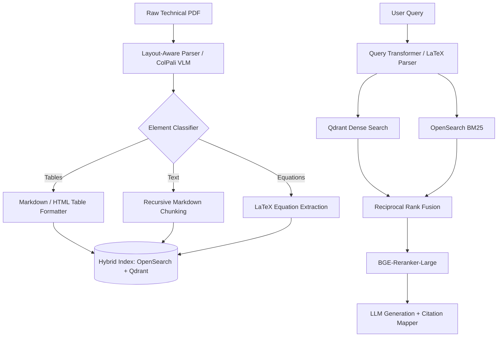
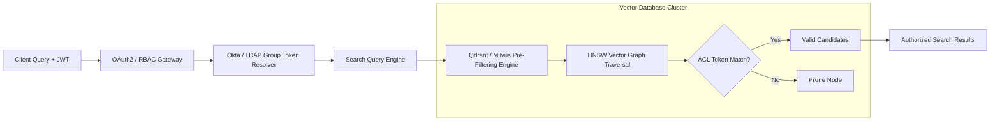
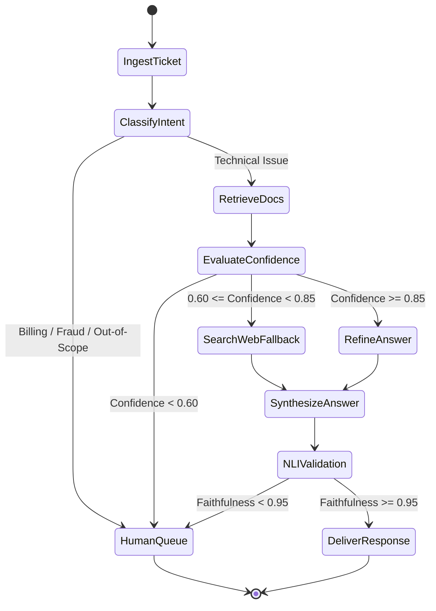
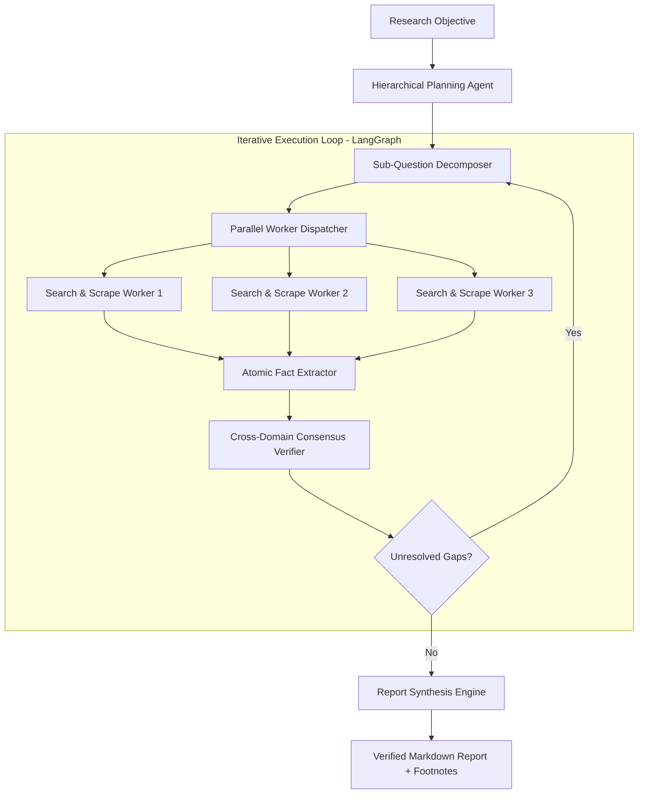
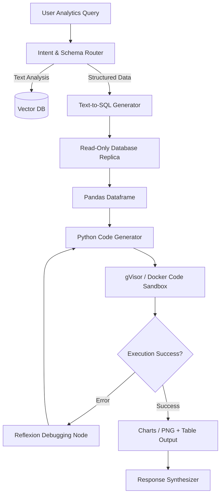
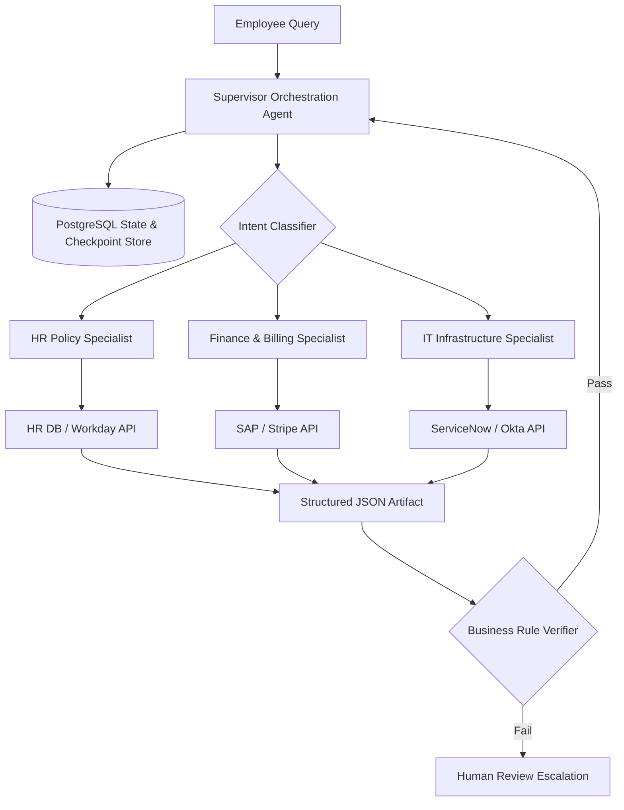
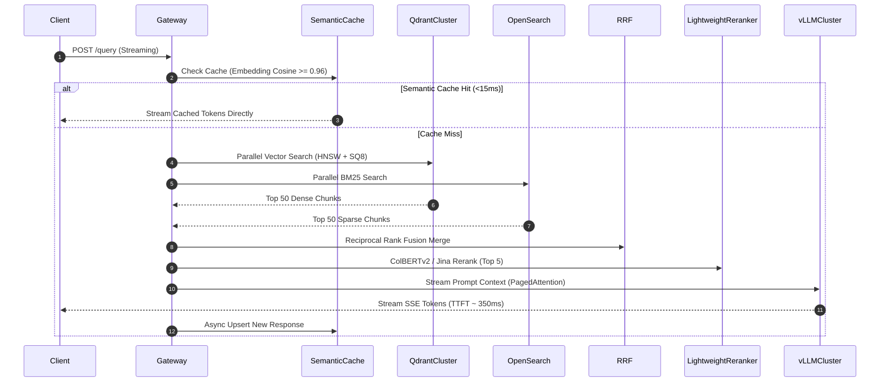
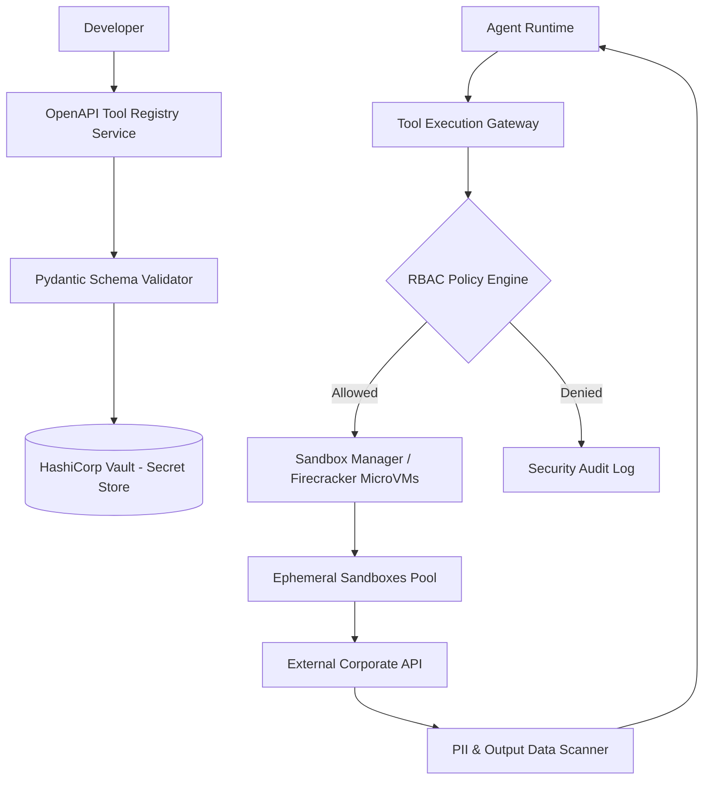

# The Definitive 41-Section Curriculum, Production System Design Blueprints, and Capstone Roadmap
## University-Level and Enterprise-Grade Mastery in RAG and Agentic AI Systems

---

# PART 1: The Master 41-Section Curriculum (Levels 0 to 13)

This curriculum bridges foundational computational mathematics, information retrieval theory, advanced multi-vector indexing, knowledge graphs, agentic cognitive architectures, distributed systems engineering, and AI safety.

---

```
                                  CURRICULUM ARCHITECTURE
====================================================================================================
 Level 0: Foundations & Prerequisites (Sec 1-3)
 Level 1: Dense Retrieval & Embeddings (Sec 4-6)
 Level 2: Sparse & Hybrid Retrieval (Sec 7-9)
 Level 3: Advanced Document Processing & Chunking (Sec 10-12)
 Level 4: Reranking & Compression (Sec 13-15)
 Level 5: Query Transformation & Multi-Query Retrieval (Sec 16-18)
 Level 6: Graph & Knowledge-Augmented RAG (Sec 19-21)
 Level 7: Self-Reflective & Adaptive RAG (Sec 22-24)
 Level 8: Evaluation, Observability & Benchmarking (Sec 25-27)
 Level 9: Production Vector Databases & Distributed Architecture (Sec 28-30)
 Level 10: Agent Foundations & Tool Augmentation (Sec 31-33)
 Level 11: Agent Planning, Memory & Reflection (Sec 34-36)
 Level 12: Multi-Agent Systems & Orchestration (Sec 37-39)
 Level 13: Capstone, Safety, Security & Future Frontiers (Sec 40-41)
====================================================================================================
```

---

## LEVEL 0: Foundations & Prerequisites

### Section 1: Linear Algebra, Vector Spaces, Matrix Decompositions & Similarity Metrics
- **Theoretical Foundations**: Euclidean vector spaces $\mathbb{R}^d$, inner products, Cauchy-Schwarz inequality, vector norms ($L_1, L_2, L_\infty$), Singular Value Decomposition (SVD), Principal Component Analysis (PCA), and geometric interpretations of cosine similarity vs. dot product vs. Mahalanobis distance.
- **Implementation Mechanics**: Vectorized cosine distance, batch dot products using NumPy and PyTorch, benchmarking SIMD instruction sets (AVX-512) and GPU Tensor Core matrix multiplications.
- **Mathematical Formulation**:
  $$\cos(\mathbf{u}, \mathbf{v}) = \frac{\mathbf{u} \cdot \mathbf{v}}{\|\mathbf{u}\|_2 \|\mathbf{v}\|_2} = \sum_{i=1}^d \frac{u_i v_i}{\sqrt{\sum u_i^2} \sqrt{\sum v_i^2}}$$
- **Required Paper**: Vaswani et al. (2017) *Attention Is All You Need*.
- **Hands-On Lab**: Implement a standalone, zero-dependency C++/Python vector math engine that computes cosine similarity and Euclidean distance over 1,000,000 1536-dimensional vectors with multi-threading and AVX-256 acceleration.
- **Self-Assessment Quiz**:
  - *Question*: Why does projecting un-normalized vectors into an inner product space distort ranking in semantic search?
  - *Answer*: Vectors with arbitrarily large $L_2$ norms yield high inner product values regardless of angle, causing lengthy documents with repetitive terms to artificially dominate nearest neighbor results.

---

### Section 2: Tokenization Algorithms, Language Modeling Fundamentals & Attention Mechanics
- **Theoretical Foundations**: Byte-Pair Encoding (BPE), WordPiece, SentencePiece, subword tokenizers, cross-entropy loss, causal masking, autoregressive next-token prediction, and multi-head self-attention mechanics.
- **Implementation Mechanics**: Building a BPE tokenizer from raw text scratch; tracing query ($Q$), key ($K$), and value ($V$) matrix projections; calculating attention weight matrices and causal decoders.
- **Mathematical Formulation**:
  $$\text{Softmax}\left(\frac{QK^T}{\sqrt{d_k}}\right)V$$
- **Required Paper**: Devlin et al. (2019) *BERT: Pre-training of Deep Bidirectional Transformers*.
- **Hands-On Lab**: Build a minimal BPE tokenizer in Python that trains on 50MB of raw text, creates a 32,000-token vocabulary, and handles out-of-vocabulary bytes cleanly.
- **Self-Assessment Quiz**:
  - *Question*: Why is dividing by $\sqrt{d_k}$ critical in scaled dot-product attention?
  - *Answer*: As $d_k$ grows large, the dot products grow large in magnitude, pushing the softmax function into regions with extremely small gradients (gradient vanishing), which impedes training stability.

---

### Section 3: Information Retrieval Foundations: TF-IDF, BM25, Inverted Index & Classical IR Metrics
- **Theoretical Foundations**: Classical Information Retrieval (IR), Zipf's law, term frequency saturation, inverted index posting lists, Okapi BM25 ranking algorithm, Precision, Recall, Mean Reciprocal Rank (MRR), and Normalized Discounted Cumulative Gain (NDCG).
- **Implementation Mechanics**: Constructing an in-memory inverted index with dictionary term pointers and document posting lists; calculating BM25 scores with document length normalization.
- **Mathematical Formulation**:
  $$\text{BM25}(D, Q) = \sum_{i=1}^{|Q|} \text{IDF}(q_i) \cdot \frac{f(q_i, D) \cdot (k_1 + 1)}{f(q_i, D) + k_1 \cdot \left(1 - b + b \cdot \frac{|D|}{\text{avgdl}}\right)}$$
- **Required Paper**: Robertson & Zaragoza (2009) *The Probabilistic Relevance Framework: BM25 and Beyond*.
- **Hands-On Lab**: Implement a high-throughput inverted index and BM25 search engine from scratch in Python/Rust, indexing 100,000 Wikipedia abstracts and benchmarking query latency against Lucene.
- **Self-Assessment Quiz**:
  - *Question*: What is the physical meaning of the BM25 $b$ parameter, and what occurs when $b=0$?
  - *Answer*: The parameter $b \in [0, 1]$ controls the degree of document length normalization. When $b=0$, length normalization is completely disabled, treating a term occurrence in a 10,000-word document identically to one in a 10-word document.

---

## LEVEL 1: Dense Retrieval & Embeddings

### Section 4: Deep Bi-Encoders, Contrastive Learning & Triplet Loss Mechanics
- **Theoretical Foundations**: Dual-encoder architectures, representation mapping, contrastive estimation, InfoNCE loss, Multiple Negatives Ranking Loss (MNRL), in-batch negatives, and hard negative mining.
- **Implementation Mechanics**: Fine-tuning a BERT bi-encoder with PyTorch and Sentence-Transformers; building efficient negative sampling loaders.
- **Mathematical Formulation**:
  $$\mathcal{L}_{\text{InfoNCE}} = -\log \frac{\exp(\text{sim}(q, d^+) / \tau)}{\exp(\text{sim}(q, d^+) / \tau) + \sum_{j=1}^N \exp(\text{sim}(q, d_j^-) / \tau)}$$
- **Required Paper**: Karpukhin et al. (2020) *Dense Passage Retrieval for Open-Domain Question Answering (DPR)*.
- **Hands-On Lab**: Train a custom dense passage bi-encoder using hard BM25 negatives on MS MARCO subset; evaluate top-20 retrieval accuracy against BM25 baseline.
- **Self-Assessment Quiz**:
  - *Question*: Why do in-batch negatives dramatically reduce training compute for contrastive bi-encoders?
  - *Answer*: For a batch size of $B$, each query uses the positive documents of the other $B-1$ queries as negative examples, yielding $B(B-1)$ negative training pairs per batch at zero additional embedding compute cost.

---

### Section 5: Vector Representation Geometry, Dimensionality Reduction & Anisotropy
- **Theoretical Foundations**: The geometry of pretrained transformer representation spaces, the representation collapse problem, vector anisotropy ("the cone effect"), singular value spectrum decay, and dimensionality reduction techniques (PCA, UMAP, t-SNE).
- **Implementation Mechanics**: Measuring cosine similarity baseline distributions across random token pairs; implementing post-processing whitening transformations and mean-centering to mitigate anisotropy.
- **Mathematical Formulation**:
  $$\mathbf{v}_{\text{whitened}} = (\mathbf{v} - \boldsymbol{\mu}) W, \quad \text{where } W = V \Lambda^{-1/2} V^T$$
- **Required Paper**: Ethayarajh (2019) *How Contextual are Contextualized Representations? Comparing the Geometry of BERT, ELMo, and GPT-2 Embeddings*.
- **Hands-On Lab**: Write a Python script to compute the cosine anisotropy coefficient across 50,000 sentence embeddings from standard BERT; apply ZCA whitening and show the resulting uniform distribution.
- **Self-Assessment Quiz**:
  - *Question*: How does vector space anisotropy harm cosine similarity in nearest neighbor search?
  - *Answer*: In an anisotropic space, all vector embeddings cluster inside a narrow cone, causing random pairs of unrelated sentences to have artificially high cosine similarities (e.g., 0.7–0.9), collapsing discriminative power.

---

### Section 6: State-of-the-Art Embedding Architectures & Matryoshka Embeddings
- **Theoretical Foundations**: Asymmetric search embeddings, instruction-tuned representations (Instructor, BGE-en-v1.5, E5-Mistral), and Matryoshka Representation Learning (MRL) for elastic dimension truncation without retraining.
- **Implementation Mechanics**: Generating MRL embeddings; truncating 1536-dim vectors down to 256 or 64 dims; evaluating recall degradation vs. storage savings.
- **Mathematical Formulation**:
  $$\mathcal{L}_{\text{MRL}} = \sum_{m \in \mathcal{M}} c_m \cdot \mathcal{L}_{\text{task}}(W_{1:m} \mathbf{h})$$
- **Required Paper**: Kusupati et al. (2022) *Matryoshka Representation Learning*.
- **Hands-On Lab**: Benchmark OpenAI `text-embedding-3-large` or `bge-large-en-v1.5` across dimensions [1536, 512, 256, 64] on a BEIR retrieval subset, measuring storage footprint vs. NDCG@10.
- **Self-Assessment Quiz**:
  - *Question*: What is the primary benefit of Matryoshka embeddings in enterprise search pipelines?
  - *Answer*: It enables two-tier hierarchical search: scanning a small dimension (e.g., 64-d) in RAM for fast candidate pre-selection, followed by re-scoring top candidates with the full vector (e.g., 1536-d).

---

## LEVEL 2: Sparse & Hybrid Retrieval

### Section 7: Neural Sparse Representations: SPLADE & Learned Sparse Inverted Indexes
- **Theoretical Foundations**: Neural sparse retrieval, term expansion, lexical weights via masked language models, sparsity regularization ($L_1$ and FLOPs regularization), and inverted index compatibility.
- **Implementation Mechanics**: Generating sparse lexical vectors via SPLADE; storing expanded token-weight pairs inside an inverted index (Elasticsearch/Lucene).
- **Mathematical Formulation**:
  $$w_j = \max_{t \in d} \log(1 + \text{ReLU}(W_j \cdot \text{Transformer}(t)))$$
- **Required Paper**: Formal et al. (2021) *SPLADE: Sparse Lexical and Expansion Model for Information Retrieval*.
- **Hands-On Lab**: Deploy a SPLADE model in PyTorch, index 10,000 technical domain documents, and show how SPLADE expands queries with synonyms without dense vector databases.
- **Self-Assessment Quiz**:
  - *Question*: Why does SPLADE solve the vocabulary mismatch problem while preserving exact keyword lookup?
  - *Answer*: It projects text into the model's entire 30,000-token vocabulary space, assigning neural importance weights to both present words and unmentioned but relevant synonyms.

---

### Section 8: Late Interaction & Multi-Vector Matching: ColBERT & ColBERTv2
- **Theoretical Foundations**: Late interaction mechanics, token-level multi-vector search, the MaxSim operator, residual compression, centroid quantization, and index pruning.
- **Implementation Mechanics**: Building a ColBERT index using RAGatouille/Stanford ColBERT; tracing query token interaction against passage token embeddings.
- **Mathematical Formulation**:
  $$S(Q, D) = \sum_{i \in |Q|} \max_{j \in |D|} \left( E_{Q,i} \cdot E_{D,j}^T \right)$$
- **Required Paper**: Santhanam et al. (2022) *ColBERTv2: Effective and Efficient Retrieval via Lightweight Late Interaction*.
- **Hands-On Lab**: Index a complex PDF documentation corpus with ColBERTv2, benchmark search latency vs. cross-encoders, and measure the index compression ratio.
- **Self-Assessment Quiz**:
  - *Question*: How does ColBERTv2 achieve a 6x–10x reduction in memory footprint compared to ColBERTv1?
  - *Answer*: It quantizes token vectors into cluster centroids and stores low-bit quantized residual vectors (1–2 bits per dimension) rather than raw float32 vectors.

---

### Section 9: Production Hybrid Search: Dense + Sparse Fusion & Reciprocal Rank Fusion
- **Theoretical Foundations**: Rank aggregation theory, score calibration pitfalls, Reciprocal Rank Fusion (RRF), alpha-blended score combination, and hybrid query orchestration.
- **Implementation Mechanics**: Building a production hybrid search pipeline combining Qdrant/Milvus (dense) with Elasticsearch/OpenSearch (BM25); applying client-side RRF merging.
- **Mathematical Formulation**:
  $$\text{RRF\_Score}(d \in D) = \sum_{m \in M} \frac{1}{k + r_m(d)}, \quad k = 60$$
- **Required Paper**: Cormack, Clarke, & Büttcher (2009) *Reciprocal Rank Fusion Outperforms Condorcet and Individual Rank Learning Methods*.
- **Hands-On Lab**: Construct a dual-retriever pipeline using Dockerized OpenSearch and Qdrant; write an async aggregator in Python executing concurrent searches and fusing results with RRF.
- **Self-Assessment Quiz**:
  - *Question*: Why does naive score addition ($S_{\text{dense}} + S_{\text{BM25}}$) fail in production?
  - *Answer*: BM25 scores are unbounded and sensitive to query length, whereas dense similarities are bounded in $[-1, 1]$, causing BM25 scores to disproportionately dominate or be washed out depending on term frequency.

---

## LEVEL 3: Advanced Document Processing & Chunking

### Section 10: Multi-Modal Document Parsing: Unstructured PDFs, Tables & Vision-RAG
- **Theoretical Foundations**: PDF layout hierarchies, optical character recognition (OCR), visual bounding box detection, layout-aware transformers (LayoutLM), table structure extraction, and Vision-Language Models (VLMs) as parsers (ColPali).
- **Implementation Mechanics**: Processing multi-column research papers using pdfminer, PyMuPDF, and OCR engines (Tesseract/PaddleOCR); generating markdown representations with preserved HTML table structures.
- **Required Paper**: Faysse et al. (2024) *ColPali: Efficient Document Retrieval with Vision Language Models*.
- **Hands-On Lab**: Build a PDF extraction pipeline that processes complex corporate financial reports (10-Ks), extracts embedded tables into clean Markdown tables, and converts diagrams into image-summary chunks.
- **Self-Assessment Quiz**:
  - *Question*: Why does raw text extraction (e.g., standard `pdftotext`) fail on multi-column PDF layouts?
  - *Answer*: It reads text bounding boxes in raw stream order (left-to-right across the entire page width), interleaving text lines from column 1 and column 2, destroying semantic meaning.

---

### Section 11: Chunking Strategies: Fixed, Recursive, Token-Aware & Semantic Chunking
- **Theoretical Foundations**: Semantic boundaries, sliding window stride math, recursive character splitting, document object model (DOM) structural chunking, and embedding distance-based semantic boundary detection.
- **Implementation Mechanics**: Writing a semantic chunker that tracks sliding cosine distances between adjacent sentence embeddings and splits on statistical anomalies.
- **Mathematical Formulation**:
  $$\text{Split Point } i \iff \text{dist}(E(s_i), E(s_{i+1})) > \mu_{\text{dist}} + \kappa \cdot \sigma_{\text{dist}}$$
- **Required Paper**: Wang et al. (2024) *Searching for Best Practices in Retrieval-Augmented Generation*.
- **Hands-On Lab**: Benchmark Fixed (500 chars), Recursive Character (500 tokens), and Semantic Chunking on a 100-page legal contract dataset; evaluate boundary cut errors on entity spans.
- **Self-Assessment Quiz**:
  - *Question*: What is the primary drawback of Semantic Chunking compared to Recursive Character Chunking?
  - *Answer*: High computational overhead during ingestion, as it requires generating dense embeddings for every individual sentence in the corpus before evaluating split thresholds.

---

### Section 12: Context Enrichment: Parent-Child Chunking, Sentence Windows & Metadata Injection
- **Theoretical Foundations**: Decoupled search vs. context window representations, small-to-large retrieval, parent-document retrieval, sentence window expansion, and document metadata inheritance (timestamps, author, ACLs, summaries).
- **Implementation Mechanics**: Storing small 100-token leaf chunks mapped to parent 1000-token chunks in PostgreSQL; writing an indexer that injects parent metadata headers into chunk prefixes.
- **Required Paper**: Gao et al. (2023) *Retrieval-Augmented Generation for Large Language Models: A Survey*.
- **Hands-On Lab**: Build a Parent-Document Retrieval pipeline using LangChain/LlamaIndex; prove that leaf-chunk matching combined with parent-context feeding increases generation accuracy.
- **Self-Assessment Quiz**:
  - *Question*: Why does Parent-Child retrieval resolve the tension between retrieval precision and generation context?
  - *Answer*: Small child chunks produce focused embeddings that match query specifics without semantic dilution, while returning the parent chunk provides the LLM the broader context needed to generate complete answers.

---

## LEVEL 4: Reranking & Compression

### Section 13: Cross-Encoder Rerankers: Architecture, Hard Negative Mining & Scoring Mechanics
- **Theoretical Foundations**: Cross-encoders vs. bi-encoders, full token-to-token all-to-all cross-attention, cross-encoder fine-tuning with hard negatives mined from dense retrievers, and latency-accuracy trade-offs.
- **Implementation Mechanics**: Integrating BGE-Reranker-Large or Cohere Rerank-v3 into a multi-stage retrieval pipeline; measuring latency and GPU memory usage.
- **Mathematical Formulation**:
  $$S_{\text{Cross}}(Q, D) = \text{Softmax}\left( W \cdot \text{Transformer}([Q; [SEP]; D])_{[CLS]} \right)$$
- **Required Paper**: Nogueira & Cho (2019) *Passage Re-ranking with BERT*.
- **Hands-On Lab**: Deploy a local cross-encoder service on an NVIDIA GPU using TensorRT-LLM/ONNX; rerank top-100 hybrid candidates to top-5 in under 30ms.
- **Self-Assessment Quiz**:
  - *Question*: Why cannot cross-encoders be pre-indexed in a vector database for direct $O(1)$ search?
  - *Answer*: Because cross-encoders compute dynamic cross-attention between query tokens and document tokens simultaneously; the document representation cannot be computed without the query.

---

### Section 14: LLM-Based Rerankers & Listwise Ranking: RankGPT & MonoT5
- **Theoretical Foundations**: Pointwise, pairwise, and listwise ranking; prompting LLMs for ranking permutations; sliding window listwise sorting algorithms; MonoT5 sequence-to-sequence ranking.
- **Implementation Mechanics**: Implementing RankGPT using zero-shot prompting with sliding window permutations over 50 candidate passages.
- **Required Paper**: Sun et al. (2023) *Is ChatGPT Good at Search? Investigating Large Language Models as Re-Ranking Agents (RankGPT)*.
- **Hands-On Lab**: Build a sliding-window RankGPT listwise reranker; evaluate its ranking accuracy against a BGE Cross-Encoder on a complex reasoning dataset.
- **Self-Assessment Quiz**:
  - *Question*: What is the primary limitation of using listwise LLM reranking in high-throughput production?
  - *Answer*: High inference latency and API token cost, along with occasional model formatting failures (dropping candidate IDs or hallucinating nonexistent ranks).

---

### Section 15: Contextual Compression, Prompt Compaction & Token Pruning
- **Theoretical Foundations**: Token redundancy, prompt entropy, extractive sentence selection, information bottleneck theory, and LongLLMLingua token perplexity filtering.
- **Implementation Mechanics**: Passing 4,000 tokens of retrieved text through LongLLMLingua; measuring token compression ratio, runtime overhead, and generation answer quality.
- **Mathematical Formulation**:
  $$\text{Keep Token } t_i \iff -\log p_{\text{small}}(t_i | t_{<i}) > \tau_{\text{entropy}}$$
- **Required Paper**: Jiang et al. (2023) *LongLLMLingua: Accelerating and Enhancing LLMs in Long Context Scenarios via Prompt Compression*.
- **Hands-On Lab**: Build a prompt compression middleware that takes 10 retrieved chunks (5,000 tokens), compresses them down to 1,500 tokens in under 50ms, and validates that question-answering accuracy is preserved.
- **Self-Assessment Quiz**:
  - *Question*: Why does compressing context sometimes increase answer accuracy rather than degrade it?
  - *Answer*: By stripping away irrelevant boilerplate, syntactic filler, and distractor sentences, it increases the signal-to-noise ratio and mitigates the "Lost in the Middle" attention degradation effect.

---

## LEVEL 5: Query Transformation & Multi-Query Retrieval

### Section 16: Query Rewriting, Expansion & Disambiguation for Conversational RAG
- **Theoretical Foundations**: Conversational history resolution, coreference resolution, anaphora, query condensation, and intent classification.
- **Implementation Mechanics**: Building a prompt-based query condenser that transforms multi-turn conversational history into a standalone retrieval query; tracking coreference resolution accuracy.
- **Required Paper**: Vakulenko et al. (2021) *Question Rewriting for Conversational Question Answering*.
- **Hands-On Lab**: Write a conversational query transformation pipeline that takes a 10-turn dialogue containing pronouns ("it", "they", "that company") and produces self-contained search queries in <200ms.
- **Self-Assessment Quiz**:
  - *Question*: Why is running retrieval on raw conversational follow-up questions (e.g., "What was their revenue in that year?") guaranteed to fail?
  - *Answer*: The query lacks the noun entities and temporal anchors needed to locate relevant passages in the vector space, matching generic pronoun contexts instead.

---

### Section 17: Hypothetical Document Embeddings (HyDE) & Multi-Query Decomposition
- **Theoretical Foundations**: Query-document asymmetry, zero-shot dense retrieval, speculative answer hallucination as search proxy, and multi-query parallel fan-out.
- **Implementation Mechanics**: Implementing HyDE: Generating 3 hypothetical passages via a small LLM, computing average embedding vectors, and executing vector search.
- **Mathematical Formulation**:
  $$\mathbf{v}_{\text{HyDE}} = \frac{1}{N} \sum_{i=1}^N E\left(\text{LLM}(q, \text{temp}=0.7)\right)$$
- **Required Paper**: Gao et al. (2023) *Precise Zero-Shot Dense Retrieval without Relevance Labels (HyDE)*.
- **Hands-On Lab**: Implement HyDE and Multi-Query retrieval side-by-side in LangChain/LlamaIndex; evaluate zero-shot hit rate on an out-of-domain technical dataset vs. baseline DPR.
- **Self-Assessment Quiz**:
  - *Question*: In what scenario does HyDE degrade retrieval performance compared to raw query search?
  - *Answer*: When the LLM has zero knowledge of obscure entities (e.g., internal proprietary project code names) and hallucinates a completely misleading hypothesis, pointing retrieval toward wrong semantic clusters.

---

### Section 18: Step-Back Prompting & Dynamic Query Routing / Semantic Dispatch
- **Theoretical Foundations**: High-level abstraction retrieval, concept generalization, semantic query routing, and embedding classifiers.
- **Implementation Mechanics**: Constructing an automated Semantic Router using embedding centroid distance to route incoming queries between Vector Search, SQL Database, API Tool, or Direct LLM Generation.
- **Required Paper**: Zheng et al. (2023) *Take a Step Back: Evoking Reasoning via Abstraction in Large Language Models*.
- **Hands-On Lab**: Build a zero-latency Semantic Dispatcher using vector centroid cosine thresholds that routes queries to 4 distinct specialist backends in under 15ms.
- **Self-Assessment Quiz**:
  - *Question*: What is the purpose of "Step-Back Prompting" in retrieval?
  - *Answer*: It abstracts specific queries into high-level fundamental concepts (e.g., from "Why did my physics engine crash at $t=5$?" to "What are the core equations of physics engine integration?"), retrieving background principles that frame the specific answer.

---

## LEVEL 6: Graph & Knowledge-Augmented RAG

### Section 19: Knowledge Graph Foundations: Entities, Relations, Triples & Graph Databases
- **Theoretical Foundations**: Knowledge representation, Resource Description Framework (RDF), labeled property graphs (LPG), Cypher query language, ontology definition, and entity disambiguation.
- **Implementation Mechanics**: Setting up Neo4j; ingesting entities and relationships; writing Cypher queries to traverse multi-hop graph neighborhoods.
- **Mathematical Formulation**:
  $$\mathcal{G} = (\mathcal{V}, \mathcal{E}, \mathcal{R}), \quad \text{Triple: } (s, r, o) \in \mathcal{V} \times \mathcal{R} \times \mathcal{V}$$
- **Required Paper**: Hogan et al. (2021) *Knowledge Graphs*. ACM Computing Surveys.
- **Hands-On Lab**: Ingest unstructured text into Neo4j using an LLM to extract triples $(s, r, o)$; execute multi-hop Cypher queries to resolve complex entity relationships.
- **Self-Assessment Quiz**:
  - *Question*: When does a Knowledge Graph outperform a Vector Database in retrieval?
  - *Answer*: When answering multi-hop structural queries, path-finding queries, and queries requiring global structural aggregation across millions of interconnected entities.

---

### Section 20: Microsoft GraphRAG: Hierarchical Leiden Community Detection & Summarization
- **Theoretical Foundations**: Graph RAG principles, hierarchical Leiden community detection, modularity optimization, and bottom-up recursive community summarization.
- **Implementation Mechanics**: Running the Microsoft GraphRAG pipeline over a multi-document corpus; inspecting hierarchical community summaries (C0, C1, C2); running Global Search queries.
- **Required Paper**: Edge et al. (2024) *From Local to Global: A Graph RAG Approach to Query-Focused Summarization*.
- **Hands-On Lab**: Deploy GraphRAG over an enterprise policy corpus; execute Global Search and compare its thematic completeness against standard vector RAG.
- **Self-Assessment Quiz**:
  - *Question*: How does GraphRAG answer queries like "What are the main themes across this 10,000-page dataset?" when standard vector RAG fails?
  - *Answer*: It runs map-reduce summarization across pre-computed hierarchical community summaries generated during offline Leiden graph partitioning, synthesizing high-level themes without relying on vector similarity.

---

### Section 21: Hybrid Graph-Vector Retrieval: Graph Traversals Combined with Dense Similarity
- **Theoretical Foundations**: Unifying vector proximity with graph topology, graph-enhanced vector indexing, knowledge graph embeddings (TransE, ComplEx), and Graph Neural Networks (GNNs) for retrieval.
- **Implementation Mechanics**: Building a hybrid retrieval engine in Python that first searches vector embeddings to identify entry point entities, then traverses Neo4j graph relationships to collect multi-hop context.
- **Required Paper**: Yasunaga et al. (2021) *QA-GNN: Reasoning with Language Models and Knowledge Graphs for Question Answering*.
- **Hands-On Lab**: Implement a Graph-Vector hybrid retrieval engine: Locate the top-3 nearest neighbor entity nodes via vector search, expand their 2-hop graph neighborhood in Neo4j, and feed the subgraph to the LLM.
- **Self-Assessment Quiz**:
  - *Question*: What is the primary benefit of using vector search as an entry point into a Knowledge Graph?
  - *Answer*: It resolves messy, fuzzy natural language queries to the correct starting graph nodes, avoiding brittle exact-string entity linking.

---

## LEVEL 7: Self-Reflective & Adaptive RAG

### Section 22: Self-RAG: Reflection Tokens, Self-Assessment & Controlled Retrieval Generation
- **Theoretical Foundations**: Self-reflective generation, critique tokens (`[Retrieve]`, `[IsRel]`, `[IsSup]`, `[IsUse]`), training auxiliary critic models, and beam search decoding with reflection constraints.
- **Implementation Mechanics**: Implementing the Self-RAG prompting protocol with an open-weights model; parsing reflection outputs to adaptively trigger retrieval passes.
- **Required Paper**: Asai et al. (2024) *Self-RAG: Learning to Retrieve, Generate, and Critique through Self-Reflection*.
- **Hands-On Lab**: Build a self-reflective RAG loop that dynamically evaluates if retrieved text supports its generated draft, re-prompting itself if support is insufficient.
- **Self-Assessment Quiz**:
  - *Question*: What is the role of the `[IsSup]` token in Self-RAG?
  - *Answer*: It acts as an internal Natural Language Inference (NLI) check, verifying whether the generated statement is factually supported by the retrieved passage.

---

### Section 23: Corrective RAG (CRAG) & Speculative RAG: Confidence-Gated Verification
- **Theoretical Foundations**: Corrective retrieval, confidence scoring, ambiguous retrieval handling, web fallback channels, and speculative drafter-verifier RAG pipelines.
- **Implementation Mechanics**: Building a CRAG state graph: Retrieval Evaluator scores passage confidence $\gamma$; if low, trigger Google/Tavily search; if high, run knowledge refinement.
- **Required Paper**: Yan et al. (2024) *Corrective Retrieval Augmented Generation (CRAG)*.
- **Hands-On Lab**: Build a CRAG pipeline in LangGraph with confidence scoring that falls back to external web search when local vector retrieval confidence is below 0.6.
- **Self-Assessment Quiz**:
  - *Question*: What is the primary function of the Knowledge Refinement module in CRAG?
  - *Answer*: It breaks down retrieved documents into fine-grained atomic facts and filters out irrelevant sentences, preventing distractor noise from entering the prompt.

---

### Section 24: Adaptive-RAG & RAPTOR: Dynamic Complexity Routing & Recursive Tree Search
- **Theoretical Foundations**: Query complexity classification, single-hop vs. multi-hop vs. non-retrieval routing, recursive abstractive tree processing, and Gaussian Mixture Model clustering over embeddings.
- **Implementation Mechanics**: Constructing a RAPTOR tree from a 50-page document using recursive clustering and LLM summarization; executing multi-level tree traversal.
- **Required Paper**: Sarthi et al. (2024) *RAPTOR: Recursive Abstractive Processing for Tree-Organized Retrieval*.
- **Hands-On Lab**: Implement a minimal RAPTOR indexing tree in Python: Embed chunks, cluster using scikit-learn GMM, summarize clusters via LLM, re-embed summaries, and query across leaf and root nodes.
- **Self-Assessment Quiz**:
  - *Question*: Why does RAPTOR allow answering both specific detail questions and overarching thematic questions within the same index?
  - *Answer*: Because its tree index contains both raw leaf chunks (for granular fact lookups) and recursive summary nodes (for high-level synthesis).

---

## LEVEL 8: Evaluation, Observability & Benchmarking

### Section 25: RAG Triad & Metric Decomposition: Faithfulness, Relevance, Precision & Recall
- **Theoretical Foundations**: Evaluation decomposition, the RAG Triad (Context Relevance, Groundedness/Faithfulness, Answer Relevance), Context Precision, and Context Recall.
- **Implementation Mechanics**: Implementing mathematical evaluators for Faithfulness and Context Precision using open-source LLM judges and NLI cross-encoders.
- **Mathematical Formulation**:
  $$\text{Context Precision@}k = \frac{\sum_{i=1}^k \text{Precision@}i \times rel_i}{\text{Total relevant items in top-}k}$$
- **Required Paper**: Es et al. (2023) *RAGAS: Automated Evaluation of Retrieval Augmented Generation*.
- **Hands-On Lab**: Build an automated evaluation script using Ragas to evaluate 100 question-answer pairs; generate a radar chart across Faithfulness, Context Precision, and Answer Relevance.
- **Self-Assessment Quiz**:
  - *Question*: If a RAG system has high Context Recall but low Faithfulness, what is failing?
  - *Answer*: Retrieval successfully returned the necessary ground-truth documents, but the generator hallucinated claims not supported by those documents.

---

### Section 26: Automated Evaluation Frameworks & LLM-as-a-Judge Calibration / Debiasing
- **Theoretical Foundations**: LLM-as-a-Judge vulnerabilities, position bias, verbosity bias, self-enhancement bias, calibration techniques, reference-guided evaluation, and pairwise vs. single-answer rubrics.
- **Implementation Mechanics**: Building a debiased LLM judge pipeline with position-swapping, strict multi-point rubrics, and length-penalty normalization.
- **Required Paper**: Zheng et al. (2023) *Judging LLM-as-a-Judge with MT-Bench and Chatbot Arena*.
- **Hands-On Lab**: Run an experiment measuring position bias in GPT-4 evaluation by swapping document positions A and B across 50 pairs; quantify the flip rate and implement swap-consistency filtering.
- **Self-Assessment Quiz**:
  - *Question*: How does position-swap consistency filtering protect evaluation integrity?
  - *Answer*: By evaluating $(A, B)$ and $(B, A)$, it accepts the judgement only if the model selects the same output regardless of order, discarding evaluations contaminated by position bias.

---

### Section 27: Production Telemetry, Distributed Tracing & Continuous Benchmark Regression Suites
- **Theoretical Foundations**: LLMOps telemetry standards, OpenLLMetry, OpenTelemetry spans, trace IDs, monitoring retrieval drift, tracking token costs, and automated CI/CD regression test suites.
- **Implementation Mechanics**: Instrumenting a RAG application with OpenTelemetry and Arize Phoenix / LangSmith; setting up CI/CD GitHub Actions that fail builds if Faithfulness drops below 0.90.
- **Required Paper**: Chen et al. (2024) *Benchmarking Large Language Models in Retrieval-Augmented Generation (RGB)*.
- **Hands-On Lab**: Instrument an end-to-end FastAPI RAG service with OpenTelemetry; export spans to Jaeger/Phoenix, capturing trace spans for embedding, vector search, reranking, and generation.
- **Self-Assessment Quiz**:
  - *Question*: What is the primary indicator of retrieval drift in production telemetry?
  - *Answer*: A persistent drop in average vector similarity scores or an increase in the proportion of fallback web searches over time, signaling that user queries have shifted away from the indexed corpus distribution.

---

## LEVEL 9: Production Vector Databases & Distributed Architecture

### Section 28: Approximate Nearest Neighbor (ANN) Algorithms: HNSW, IVF, ScaNN & Quantization
- **Theoretical Foundations**: Nearest neighbor search theory, Navigable Small World graphs, Inverted File indexing, Product Quantization (PQ), Scalar Quantization (SQ8), Binary Quantization (BQ), and Asymmetric Distance Computation.
- **Implementation Mechanics**: Building an HNSW index with FAISS; tuning `M` (number of bi-directional links) and `efSearch` (search beam width); benchmarking recall vs. latency curves.
- **Mathematical Formulation**:
  $$d_{\text{ADC}}(\mathbf{q}, \mathbf{x}) = \sum_{m=1}^M \|\mathbf{q}^m - \mathbf{c}_{k_m}\|^2$$
- **Required Paper**: Malkov & Yashunin (2020) *Efficient and Robust Approximate Nearest Neighbor Search Using Hierarchical Navigable Small World Graphs*.
- **Hands-On Lab**: Build a FAISS benchmark script in Python comparing HNSW32, IVF4096-PQ64, and Flat indices across 1M vectors, measuring indexing time, RAM usage, QPS, and Recall@10.
- **Self-Assessment Quiz**:
  - *Question*: What is the effect of increasing `efSearch` in an HNSW index?
  - *Answer*: It widens the beam search size during query traversal, improving recall accuracy at the cost of higher query latency.

---

### Section 29: Production Vector Databases: Qdrant, Milvus, Weaviate & pgvector at Scale
- **Theoretical Foundations**: Cloud-native vector database architectures, distributed storage vs. compute decoupling, Write-Ahead Logs (WAL), segment compaction, memory-mapped files, and pgvector performance tuning.
- **Implementation Mechanics**: Deploying a distributed Qdrant/Milvus cluster on Kubernetes; configuring payload indexing and memory-mapped storage (mmap) on NVMe SSDs.
- **Required Paper**: Guo et al. (2022) *Manu: A Distributed Vector Database System*.
- **Hands-On Lab**: Deploy a production-ready Qdrant instance using Docker Compose; load 500,000 vectors with complex JSON payloads; benchmark payload-filtered search throughput.
- **Self-Assessment Quiz**:
  - *Question*: Why does HNSW indexing with naive post-filtering fail on highly selective metadata filters?
  - *Answer*: If only 0.1% of vectors match the filter, standard graph traversal gets trapped in regions with no permitted nodes, returning fewer than $k$ results or failing entirely.

---

### Section 30: Multi-Tenancy, Enterprise Access Control (ACLs) & Dynamic Filtering
- **Theoretical Foundations**: Multi-tenant data isolation patterns (Index-per-tenant vs. Namespace vs. Metadata Filtering), Role-Based Access Control (RBAC), security token expansion, and pre-filtering vs. post-filtering algorithms.
- **Implementation Mechanics**: Designing an enterprise payload schema with encrypted tenant IDs and user security group bitmaps; executing pre-filtered vector queries.
- **Required Paper**: Microsoft Security Research (2023) *Securing AI Workflows with Document-Level Access Control*.
- **Hands-On Lab**: Implement a secure multi-tenant RAG service where users can only retrieve documents matching their Okta group membership, verified via cryptographically signed JWT tokens.
- **Self-Assessment Quiz**:
  - *Question*: Why is Pre-Filtering mathematically required for enterprise document-level ACL compliance?
  - *Answer*: Post-filtering evaluates permissions *after* vector search returns top-$k$; if a user lacks access to those top-$k$, the system returns empty or partial results even though permitted relevant documents exist further down the index.

---

## LEVEL 10: Agent Foundations & Tool Augmentation

### Section 31: Agent Cognitive Architectures: ReAct, Plan-and-Solve & Structured Function Calling
- **Theoretical Foundations**: Autonomous agent paradigms, perception-action loops, Thought-Action-Observation trajectories, Plan-and-Solve decomposition, and JSON schema-enforced tool calling.
- **Implementation Mechanics**: Building a complete ReAct engine from scratch using raw LLM API calls and regex/JSON parsers; implementing strict step iteration limits.
- **Required Paper**: Yao et al. (2023) *ReAct: Synergizing Reasoning and Acting in Language Models*.
- **Hands-On Lab**: Implement a custom ReAct agent from scratch in Python (without LangChain); give it 3 math and search tools; handle parser errors with self-correcting feedback.
- **Self-Assessment Quiz**:
  - *Question*: What is the primary purpose of generating intermediate "Thoughts" before taking an "Action" in ReAct?
  - *Answer*: Thoughts provide the model additional autoregressive token computation steps to decompose problems, track progress, and decide on tool arguments before emitting actions.

---

### Section 32: Tool Augmentation: REST API Integration & Constrained Decoding
- **Theoretical Foundations**: OpenAPI specification synthesis, dynamic parameter generation, grammar-based constrained decoding (Context-Free Grammars, Outlines, Instructor), and JSON Schema validation.
- **Implementation Mechanics**: Using Instructor / Outlines to enforce exact Pydantic schema generation from an LLM; guaranteeing zero JSON syntax errors via logit masking.
- **Required Paper**: Schick et al. (2023) *Toolformer: Language Models Can Teach Themselves to Use Tools*.
- **Hands-On Lab**: Build an automated tool registry that ingests an arbitrary OpenAPI JSON spec and dynamically exposes type-safe tools to an LLM with Pydantic validation.
- **Self-Assessment Quiz**:
  - *Question*: How does grammar-guided decoding (e.g., Outlines) eliminate JSON parsing syntax errors?
  - *Answer*: At each token generation step, it masks out all vocabulary tokens that would violate the Context-Free Grammar of valid JSON, making syntax errors mathematically impossible.

---

### Section 33: Sandboxed Execution Environments: MicroVMs, Docker & Code Execution Security
- **Theoretical Foundations**: Untrusted code execution security, Server-Side Request Forgery (SSRF), container escapes, Linux cgroups, seccomp profiles, network namespaces, and microVMs (Firecracker, gVisor).
- **Implementation Mechanics**: Building a sandboxed Python execution engine using Docker with read-only root filesystems, memory limits (512MB), CPU quotas, and zero network access (`--network none`).
- **Required Paper**: Yang et al. (2024) *SWE-agent: Agent-Computer Interfaces Enable Automated Software Engineering*.
- **Hands-On Lab**: Create a secure microservice in FastAPI that accepts arbitrary Python code generated by an agent, executes it inside a locked-down gVisor sandbox, and returns stdout/stderr in under 500ms.
- **Self-Assessment Quiz**:
  - *Question*: Why is `--network none` critical when running agent-generated code?
  - *Answer*: It prevents the generated code from initiating outbound connections to internal metadata services (e.g., AWS `169.254.169.254`), databases, or external command-and-control servers for data exfiltration.

---

## LEVEL 11: Agent Planning, Memory & Reflection

### Section 34: Planning & Decomposition Algorithms: Tree-of-Thoughts (ToT) & LATS
- **Theoretical Foundations**: Systematic state space search, heuristic evaluation, Tree-of-Thoughts (ToT), Graph-of-Thoughts (GoT), and Language Agent Tree Search (LATS) incorporating Monte Carlo Tree Search (MCTS) with LLM value heuristics.
- **Implementation Mechanics**: Implementing Tree-of-Thoughts with breadth-first search (BFS) and depth-first search (DFS) frontier exploration for combinatorial problem solving.
- **Mathematical Formulation**:
  $$V(s) = \mathbb{E}_{a \sim \pi}[R(s, a)], \quad \text{MCTS UCT: } UCT(s, a) = Q(s, a) + c \sqrt{\frac{\ln N(s)}{N(s, a)}}$$
- **Required Paper**: Yao et al. (2023) *Tree of Thoughts: Deliberate Problem Solving with Large Language Models*.
- **Hands-On Lab**: Implement the Game of 24 solver using Tree-of-Thoughts in Python; compare its solution success rate against standard Chain-of-Thought prompting.
- **Self-Assessment Quiz**:
  - *Question*: Why does Tree-of-Thoughts dramatically outperform Chain-of-Thought on combinatorial planning tasks?
  - *Answer*: It enables lookahead, evaluates multiple alternative paths, and backtracks when a reasoning branch is determined to be non-viable, whereas CoT commits greedily to its initial path.

---

### Section 35: Persistent Memory Architectures: Short-Term, Episodic & MemGPT Paging
- **Theoretical Foundations**: Cognitive memory models, working memory vs. episodic memory vs. semantic memory, OS-inspired hierarchical context paging, archival search, and persistent user persona management.
- **Implementation Mechanics**: Building a hierarchical memory manager: FIFO active window, vector-indexed archival storage, and automated tool-based memory paging (`mem_write`, `mem_read`).
- **Required Paper**: Packer et al. (2023) *MemGPT: Towards LLMs as Operating Systems*.
- **Hands-On Lab**: Build a persistent conversational agent using PostgreSQL and pgvector that maintains episodic memories across multi-day conversational sessions.
- **Self-Assessment Quiz**:
  - *Question*: How does MemGPT handle interactions that exceed the LLM's physical context window?
  - *Answer*: It treats the context window as RAM and out-of-context storage as an SSD, using tool calls to page older conversation logs out to an archival vector store and retrieve them on-demand.

---

### Section 36: Self-Reflection & Error Recovery: Reflexion & Automated Feedback Loops
- **Theoretical Foundations**: Verbal reinforcement learning, self-debugging, trajectory critique, heuristic evaluation, test-driven validation, and iterative refinement.
- **Implementation Mechanics**: Building a Reflexion loop for Python code generation: Model writes code $\to$ Executes unit tests $\to$ On failure, generates natural language critique $\to$ Re-attempts with critique in context.
- **Required Paper**: Shinn et al. (2023) *Reflexion: Language Agents with Verbal Reinforcement Learning*.
- **Hands-On Lab**: Build an autonomous coding agent that solves HumanEval-style programming problems, using unit test tracebacks to drive self-reflection loops up to 5 attempts.
- **Self-Assessment Quiz**:
  - *Question*: In Reflexion, why is objective ground-truth feedback (e.g., test outputs) required for verbal reflection to be effective?
  - *Answer*: Without objective feedback from a compiler or test suite, the agent relies on its own subjective evaluation, which often leads to reinforcing its own hallucinations.

---

## LEVEL 12: Multi-Agent Systems & Orchestration

### Section 37: Multi-Agent Communication Topologies: Hierarchical, Peer-to-Peer & Pub/Sub
- **Theoretical Foundations**: Multi-agent coordination theory, communication graphs, supervisor-worker topologies, peer-to-peer debate, event-driven publish-subscribe message buses, and token budget management.
- **Implementation Mechanics**: Building a multi-agent message bus in Python with typed channels and role-based message filtering.
- **Required Paper**: Hong et al. (2024) *MetaGPT: Meta Programming for A Multi-Agent Collaborative Framework*.
- **Hands-On Lab**: Build a software development simulation with 3 agents (Product Manager, Engineer, Reviewer) communicating over an async message queue to generate a verified Python package.
- **Self-Assessment Quiz**:
  - *Question*: Why do structured message schemas prevent multi-agent communication collapse?
  - *Answer*: They prevent conversational drift, repetitive chatter, and ambiguous natural language interpretations by constraining messages to strictly validated fields and state transitions.

---

### Section 38: State Machine Frameworks: LangGraph, Temporal & Durable Orchestration
- **Theoretical Foundations**: Finite State Machines (FSMs), Directed Acyclic Graphs (DAGs), state channels, event sourcing, durable execution, checkpointing, and human-in-the-loop pause/resume semantics.
- **Implementation Mechanics**: Building a production multi-agent research workflow using LangGraph; persisting state checkpoints into a PostgreSQL database.
- **Required Paper**: Wu et al. (2023) *AutoGen: Enabling Next-Gen LLM Applications via Multi-Agent Conversation*.
- **Hands-On Lab**: Construct a LangGraph state machine with conditional routing, cycle detection, retry fallbacks, and a human approval gate before executing sensitive tools.
- **Self-Assessment Quiz**:
  - *Question*: What is the primary production benefit of durable execution engines (like Temporal or LangGraph persistence) for agent workflows?
  - *Answer*: If a server crashes mid-workflow, the system resumes execution from the last persisted checkpoint rather than restarting the entire multi-step process from scratch.

---

### Section 39: Consensus, Debate & Byzantine Failure Mitigation in Multi-Agent Systems
- **Theoretical Foundations**: Multi-agent consensus mechanisms, groupthink, sycophancy cascades, majority voting, Byzantine fault tolerance, and adversarial critique.
- **Implementation Mechanics**: Implementing a multi-agent debate protocol with 3 debater LLMs and an independent judge; implementing anonymous blind critique to eliminate sycophancy.
- **Required Paper**: Liang et al. (2023) *Encouraging Divergent Thinking in Large Language Models through Multi-Agent Debate*.
- **Hands-On Lab**: Build an adversarial multi-agent fact-checking panel where two advocate agents debate opposing viewpoints and an impartial verifier evaluates evidence against a verified document store.
- **Self-Assessment Quiz**:
  - *Question*: What causes the "sycophancy cascade" in multi-agent discussions?
  - *Answer*: Models are pre-trained to be agreeable, causing agents to conform to the first confident opinion presented rather than challenging factual errors.

---

## LEVEL 13: Capstone, Safety, Security & Future Frontiers

### Section 40: AI Security, Red Teaming & Jailbreaks: Prompt Injection & Guardrails
- **Theoretical Foundations**: Threat modeling for LLM applications (OWASP Top 10 for LLMs), direct and indirect prompt injection, data exfiltration via markdown rendering, jailbreaking attacks, and guardrail architectures (NeMo Guardrails, Llama Guard).
- **Implementation Mechanics**: Setting up a multi-layer security guardrail checking input prompts for injection attacks and output text for sensitive PII/credential leakage.
- **Required Paper**: Greshake et al. (2023) *Not what you've signed up for: Compromising Real-World LLM-Integrated Applications with Indirect Prompt Injection*.
- **Hands-On Lab**: Red-team a RAG application by injecting adversarial payloads into indexed documents; build an input/output guardrail pipeline that blocks 100% of the attacks.
- **Self-Assessment Quiz**:
  - *Question*: How does an indirect prompt injection attack exfiltrate private data via Markdown?
  - *Answer*: The injected instruction tricks the model into generating an image link like ``, causing the user's browser to make a GET request that leaks the secret in the URL parameters.

---

### Section 41: Autonomous Research Assistant Capstone & Future Frontiers
- **Theoretical Foundations**: Compound AI Systems, test-time compute scaling (inference-time search), speculative drafting, multi-modal synthesis, and autonomous research architectures.
- **Implementation Mechanics**: Integrating all 40 previous modules into the comprehensive, production-grade Autonomous Research Assistant Capstone project.
- **Required Paper**: OpenAI (2024) *Learning to Reason with LLMs (OpenAI o1 Technical Report)*.
- **Hands-On Lab**: Complete the full Capstone Project Milestone Roadmap detailed in Part 3.
- **Self-Assessment Quiz**:
  - *Question*: What is the defining principle of a Compound AI System?
  - *Answer*: Solving complex tasks through the orchestrated interaction of multiple modular components (models, retrievers, sandboxes, verifiers) rather than relying on a single monolithic model.

---

# PART 2: Eight Production System Design Architectural Blueprints

Below are complete architectural specifications for 8 real-world production systems.

---

### System Design Blueprint 1: Chatbot over Complex Technical PDFs
- **Core Challenge**: Accurately extracting and reasoning over technical manuals containing multi-column layouts, embedded tables, vector schematics, and mathematical equations without boundary corruption.
- **Target SLAs**: Latency: P95 < 2.0s; Throughput: 200 QPS; Availability: 99.9%.
- **Component Architecture**:

- **Ingestion Pipeline**: Uses a Vision-Language Model (ColPali) or LayoutLMv3 to segment PDF bounding boxes. Tables are converted into clean HTML/Markdown tables. Text is split along section header boundaries with parent metadata references.
- **Query Flow**: Hybrid search (BM25 + BGE-large) retrieves candidate chunks; top-50 results are fused via RRF and reranked using BGE-Reranker-Large down to top-5; generator cites exact page numbers and bounding box coordinates.
- **Failure Modes & Mitigations**:
  - *Table truncation*: Isolate tables as atomic chunk units with preserved header rows.
  - *OCR noise on scans*: Run dual-pass OCR with layout verification.

---

### System Design Blueprint 2: Enterprise Multi-Tenant Semantic Search with Strict ACLs
- **Core Challenge**: Searching across 50,000,000 corporate documents with sub-second latency while guaranteeing that employees cannot retrieve or infer documents outside their authorized security permissions.
- **Target SLAs**: Latency: P99 < 80ms; Throughput: 2,500 QPS; Zero unauthorized document exposure.
- **Component Architecture**:

- **Ingestion Pipeline**: Every chunk is indexed with an `acl_read_tokens` array storing allowed user IDs, department IDs, and role groups.
- **Query Flow**: Gateway extracts the user's JWT, resolves their complete security group set in Redis, and passes these tokens to the vector database as a single-stage pre-filter evaluated during HNSW traversal.
- **Production Sizing**: 64-node distributed Qdrant cluster on NVMe storage using scalar quantization (SQ8) to maintain 50M vectors in memory with sub-50ms search times.

---

### System Design Blueprint 3: Real-Time Customer Support RAG with Human-in-the-Loop
- **Core Challenge**: Automating customer support resolution across dynamic ticket histories and product documentation while safely escalating ambiguous issues to human agents.
- **Target SLAs**: Resolution Time: < 3.0s; Automation Rate: > 65%; Escalation Precision: > 95%.
- **Component Architecture**:

- **Ingestion Pipeline**: Real-time Kafka consumer indexing knowledge base updates and resolved support tickets into a hybrid vector/sparse index.
- **Safety Mitigations**: Dual-gate confidence scoring: If retrieval confidence is low or if output NLI faithfulness verification fails ($p < 0.95$), the session transitions to human support via WebSocket webhook.

---

### System Design Blueprint 4: Autonomous Deep-Research Web Agent
- **Core Challenge**: Answering broad, multifaceted research questions by iteratively browsing the live web, discovering sources, verifying claims across independent domains, and synthesizing structured reports.
- **Target SLAs**: Report Generation Time: < 90s; Source Verification: Minimum 3 independent sources per fact.
- **Component Architecture**:

- **Execution Mechanism**: Implemented in LangGraph. Breaks the goal into a DAG of sub-questions; parallel workers query search APIs (Tavily/SerpAPI), scrape web pages, and extract atomic claims; a consensus verifier checks facts across distinct web domains before synthesis.

---

### System Design Blueprint 5: Multi-Modal Data Analysis Agent
- **Core Challenge**: Analyzing unstructured text queries alongside structured relational databases (SQL) and tabular CSV/Parquet files; generating and executing Python code to create statistical charts.
- **Target SLAs**: Query-to-Chart Latency: < 4.5s; Code Execution Success Rate: > 98%.
- **Component Architecture**:

- **Security & Sandboxing**: Code runs inside an isolated microVM with resource quotas (512MB RAM, 1 CPU core, timeout: 5 seconds, zero network access). Database connections use read-only database credentials with row limits.

---

### System Design Blueprint 6: Hierarchical Multi-Agent Enterprise Assistant
- **Core Challenge**: Coordinating multiple specialized departmental agents (Billing, IT Support, HR, Engineering) within an enterprise without message cascades or routing deadlocks.
- **Target SLAs**: Multi-Agent Routing Latency: < 400ms; Task Completion Rate: > 92%.
- **Component Architecture**:

- **Orchestration Mechanics**: Supervisor agent coordinates workers using typed JSON payloads; workers execute bounded subtasks and report back to the central state store; all external actions pass through deterministic business rule verifiers.

---

### System Design Blueprint 7: Low-Latency High-Throughput Streaming RAG Pipeline
- **Core Challenge**: Serving 10,000 QPS with sub-800ms Time-To-First-Token (TTFT) on large enterprise document sets.
- **Target SLAs**: TTFT: P95 < 600ms; Total Latency: P95 < 1.5s; Throughput: 10,000 QPS.
- **Component Architecture**:

- **Performance Optimizations**:
  - *Tier 1*: Redis semantic caching with cosine threshold 0.96 (resolves 30%–50% of traffic in <15ms).
  - *Tier 2*: Asynchronous parallel retrieval (Qdrant + OpenSearch).
  - *Tier 3*: vLLM server cluster running continuous batching, PagedAttention, and static prompt prefix caching.

---

### System Design Blueprint 8: Enterprise Agent Platform: Sandboxing, Tool Registry & RBAC
- **Core Challenge**: Providing an enterprise-wide platform where developers can register custom tools, deploy agents, enforce Role-Based Access Control, and monitor system security.
- **Target SLAs**: Tool Registration Latency: < 1.0s; Security Enforcement Overhead: < 20ms; System Availability: 99.99%.
- **Component Architecture**:

- **Governance & Security**: Centralized tool registry validates OpenAPI schemas; API keys are stored in HashiCorp Vault; tool execution requests are validated against Open Policy Agent (OPA) rules before running inside ephemeral sandboxes.

---

# PART 3: Autonomous Research Assistant Capstone Project Roadmap

The Capstone synthesizes all 41 curriculum sections into a production-grade, end-to-end Autonomous Research Assistant.

---

```
                              CAPSTONE MILESTONE TIMELINE
====================================================================================================
 Milestone 1: Multi-Modal Ingestion, Structural Chunking & Hybrid Vector/Graph Indexing
                                  │
                                  ▼
 Milestone 2: Multi-Query Transformation, HyDE & Adaptive Routing
                                  │
                                  ▼
 Milestone 3: Hierarchical GraphRAG Community Extraction & Traversal Engine
                                  │
                                  ▼
 Milestone 4: Multi-Agent Planning, Research Execution & Sandboxed Tool Use
                                  │
                                  ▼
 Milestone 5: Self-Reflection, Verbal Memory & Cross-Source Verification Loops
                                  │
                                  ▼
 Milestone 6: Enterprise Hardening, CI/CD Evaluation Flywheel & Production Deployment
====================================================================================================
```

---

### Milestone 1: Multi-Modal Ingestion, Structural Chunking & Hybrid Vector/Graph Indexing
- **Core Objective**: Ingest heterogeneous corporate technical documentation (PDFs, Markdown, Word docs, CSV tables) into a unified hybrid vector and graph indexing infrastructure.
- **Technical Deliverables**:
  1. Build a layout-aware document parser using PyMuPDF and OCR to isolate text, tables, and diagrams.
  2. Implement a Token-Aware Recursive Chunker (512 tokens, 10% overlap) with parent document metadata inheritance.
  3. Deploy Qdrant for dense embeddings (BGE-en-v1.5) and OpenSearch for sparse BM25 retrieval.
  4. Write an async ingestion worker pipeline in Python using Celery/Redis, processing 1,000 pages per minute with batch vector upserts.
- **Acceptance Criteria**:
  - 100% extraction accuracy on multi-column PDF layouts without column text interleaving.
  - Sub-15ms vector insertion latency per chunk batch.

---

### Milestone 2: Multi-Query Transformation, HyDE & Adaptive Routing
- **Core Objective**: Prevent single-query vector search failures by transforming ambiguous user queries into targeted sub-searches.
- **Technical Deliverables**:
  1. Build a Semantic Query Router using embedding centroid classification to route inputs into Direct LLM, Single-Hop Search, Multi-Hop Search, or Web Fallback.
  2. Implement HyDE (Hypothetical Document Embeddings) to generate speculative context representations for abstract queries.
  3. Implement Reciprocal Rank Fusion (RRF) combining dense and sparse search results, followed by a BGE-Reranker-Large cross-encoder.
- **Acceptance Criteria**:
  - MRR@10 improvement of >15% on ambiguous and domain-specific acronym queries compared to raw dense search baselines.

---

### Milestone 3: Hierarchical GraphRAG Community Extraction & Traversal Engine
- **Core Objective**: Enable the system to answer broad, corpus-wide summarization questions that traditional vector RAG cannot address.
- **Technical Deliverables**:
  1. Implement an LLM entity-relationship extractor that processes chunks and stores typed triples $(s, r, o)$ in Neo4j.
  2. Apply the Leiden community detection algorithm to partition the entity graph into hierarchical clusters (C0, C1, C2).
  3. Generate abstractive community summaries using map-reduce LLM prompts.
  4. Implement Global Search (traversing community summaries) and Local Search (traversing multi-hop entity paths).
- **Acceptance Criteria**:
  - Successfully generates comprehensive thematic summaries over a 5,000-page dataset, outperforming baseline RAG by >50% on comprehensiveness metrics.

---

### Milestone 4: Multi-Agent Planning, Research Execution & Sandboxed Tool Use
- **Core Objective**: Deploy an autonomous multi-agent research team capable of decomposing open-ended research topics into parallel work streams.
- **Technical Deliverables**:
  1. Build a LangGraph state machine with a Lead Research Supervisor coordinating specialized worker agents (Literature Reviewer, Data Analyst, Web Verifier).
  2. Provide agents access to sandboxed tools: Tavily Search API, Local Hybrid Search, and a Python execution sandbox (Docker with `--network none`).
  3. Enforce strictly typed JSON communication schemas using Pydantic.
- **Acceptance Criteria**:
  - Agents autonomously execute multi-step research plans (5–15 steps) with zero unhandled JSON schema validation errors.

---

### Milestone 5: Self-Reflection, Verbal Memory & Cross-Source Verification Loops
- **Core Objective**: Implement self-correction mechanisms to eliminate hallucinations and ungrounded statements.
- **Technical Deliverables**:
  1. Implement a Reflexion loop: When generated claims lack support, the critique module identifies gaps and triggers targeted secondary retrieval.
  2. Build an NLI-based attribution checker that validates that every sentence in the final report is entailed by retrieved chunks ($p(\text{Entailment}) > 0.95$).
  3. Implement MemGPT-style hierarchical episodic memory in PostgreSQL to retain research progress across sessions.
- **Acceptance Criteria**:
  - Zero unverified or fabricated citations in generated research reports.
  - Faithfulness score >95% as measured by Ragas evaluation.

---

### Milestone 6: Enterprise Hardening, CI/CD Evaluation Flywheel & Production Deployment
- **Core Objective**: Deploy the system as an enterprise-grade, secure, observable microservice.
- **Technical Deliverables**:
  1. Deploy a FastAPI gateway streaming responses via Server-Sent Events (SSE).
  2. Implement OAuth2/OIDC authentication with document-level pre-filtering ACLs.
  3. Instrument end-to-end distributed tracing using OpenLLMetry and export traces to Phoenix/Jaeger.
  4. Build a continuous evaluation CI/CD pipeline using GitHub Actions that runs automated regression tests against a golden dataset of 200 questions, failing builds if Faithfulness or Context Precision drops below thresholds.
- **Acceptance Criteria**:
  - P95 streaming TTFT < 800ms.
  - 100% test pass rate across automated security injection and ACL data isolation benchmarks.
